# 前端工程化

> 什么是前端工程化？就是根据具体的业务特点，将前端的开发流程、技术、工具、经验等规范化、标准化就是前端工程化。


## 前端工程

::: tip 按工程化流程顺序排列

```txt
概述 → 脚手架 → 包管理 → 模块化 → 组件化 → 构建 → 代码规范 → 测试 → 版本控制 → CI/CD → 性能
→ 监控 → 安全 → 架构
```

:::

### 前端工程 — 概述与演进

> 前端工程化从手工劳作到自动化体系的发展历程，理解每个阶段解决了什么问题、为什么会出现下一阶段

- **第一阶段：库/框架选型**
  > 技术选型
- **第二阶段：简单构建优化**
  > 压缩、校验、资源合并等
- **第三阶段：JS/CSS 模块化开发**
  > AMD → CommonJS → UMD → ES Module / Less、Sass、Stylus
- **第四阶段：组件化**
  > 组件化开发与资源管理
- **第五阶段：自动化工程化闭环**
  > 脚手架 → 开发 → 构建 → 测试 → 部署 → 监控

### 前端工程 — 脚手架

> 项目初始化的命令行工具，快速生成项目骨架、目录结构和基础配置（`create-vue`/`create-vite`）

### 前端工程 — 包管理

> 第三方依赖的安装、版本锁定、更新与卸载，以及 monorepo 多包协作管理（`npm`/`yarn`/`pnpm`）

- **npm**
  > npm 是 Node.js 的默认包管理器，也是世界上最大的软件注册表之一。
- **yarn**
  > 由 Facebook 开发并维护，旨在解决 npm 在`速度`和`安全性`方面的一些局限性。
- **pnpm**
  > pnpm 是一种新型的包管理器，它解决了传统 npm 和 yarn 在`速度快`、`磁盘空间`上的不足
- **Bun**
  > Bun 是用于运行 JavaScript 和 TypeScript 应用程序的集成工具包，一种快速 `JavaScript 运行时`，可直接替换 Node.js。
  > Bun 采用 Zig 语言编写，底层采用 JavaScriptCore 引擎，大大减少了启动时间和内存使用量。
- **Deno**
  > Deno (/ˈdiːnoʊ/，发音为 dee-no) 是一个开源的 JavaScript、TypeScript 和 WebAssembly 运行时。
  > 它基于 V8、Rust 和 Tokio 构建。
  > 内置开发工具、强大的平台 API，并原生支持 TypeScript 和 JSX。
- **Bower** — ❌ 已弃用
  > Bower 一个面向网页的包管理器，可以管理包含 HTML、CSS、JavaScript、字体甚至图片文件的组件。
  > Bower 不连接、压缩代码或其他操作——它只是安装你需要的包和它们的依赖的正确版本。

### 前端工程 — 模块化

> 代码按功能拆分与组织，通过模块系统进行导入导出，解决全局污染和依赖顺序问题（`ES Module`/`CommonJS`），原则 — `高内聚低耦合`

#### 按需导出/导入

::: danger 注意事项

- 每个模块中可以使用`多次`按需导出
- 按需`导入的成员名称`必须和按需`导出的名称`保持`一致`
- 按需导入时，可以使用 `as 关键字`进行重命名
- 按需导入可以和默认导入一起使用

:::

#### ES Module vs CommonJS

1️⃣ 加载机制

| 特性     | CommonJS           | ES Module        |
| -------- | ------------------ | ---------------- |
| 加载方式 | 同步加载           | 异步加载         |
| 解析时机 | 运行时解析         | 编译时解析       |
| 阻塞行为 | 会阻塞主线程       | 不会阻塞主线程   |
| 依赖确定 | 代码执行时动态确定 | 编译阶段静态确定 |

2️⃣ 导入导出语法

| 特性         | CommonJS                     | ES Module                   |
| ------------ | ---------------------------- | --------------------------- |
| 导出         | `module.exports` / `exports` | `export` / `export default` |
| 导入         | `require()`                  | `import ... from ...`       |
| 默认导出支持 | 通过赋值实现                 | `export default` 原生支持   |

::: code-group

```js [CommonJS]
// 导出
module.exports = function greet() {
  console.log("Hello from CommonJS");
};

// 导入
const greet = require("./greet");
```

```js [ES Module]
// 导出
export function greet() {
  console.log("Hello from ES6 Modules");
}
export default class Greeter {}

// 导入
import { greet } from "./greet.js";
import Greeter from "./Greeter.js";
```

:::

3️⃣ 单例 vs 多例

| 特性       | CommonJS                       | ES Module                            |
| ---------- | ------------------------------ | ------------------------------------ |
| 实例模式   | 单例模式                       | 每次导入为新实例（除非显式共享状态） |
| 副作用风险 | 较高（共享状态易产生意外影响） | 较低（行为更可预测）                 |

4️⃣ 互操作性

| 环境             | CommonJS    | ES Modules                                              |
| ---------------- | ----------- | ------------------------------------------------------- |
| Node.js 原生支持 | ✅ 完全支持 | ⚠️ 需配置（`.mjs`/ `package.json` 中 `type: "module"`） |
| 现代浏览器       | ❌ 不支持   | ✅ 原生支持（`<script type="module">`）                 |
| 转译兼容         | —           | 可通过 `Babel` 等转译为 `CommonJS`                      |

5️⃣ 性能与优化

| 特性               | CommonJS    | ES Module              |
| ------------------ | ----------- | ---------------------- |
| 静态分析           | ❌ 难以实现 | ✅ 支持                |
| Tree Shaking(摇树) | ❌ 不支持   | ✅ 支持                |
| 打包优化           | 受限        | 更高效                 |
| 依赖预分析         | 困难        | 容易（得益于静态结构） |

### 前端工程 — 组件化

> 将 UI 拆分为独立可复用的组件单元，封装模板、逻辑与样式，通过 `props` / `emit` 通信

### 前端工程 — 项目构建

将源码编译打包为可上线产物

> - 编译（TS → JS、ES6 → ES5、Less → CSS）、 压缩混淆、代码分割、Tree Shaking
> - 生成 `dist`（`Webpack`、`Vite`、`Rollup`）

#### 编译 vs 转译 vs 转换
- **编译 (Compilation)**：高级语言 → 低级语言（机器码/字节码），跨层级转换。
```sh
TypeScript → 机器码（跨度大）
Java → 字节码
C 语言 → 机器码
```
- **转译 (Transpilation)**：高级语言 → 高级语言（语言A → 语言B，语义不变），同层级转换。
```sh
TypeScript → JavaScript（跨度小，都在 JS 生态）
ES6 → ES5（同语言不同版本）
```
- **转换 (Transformation)**：是"改变代码"的总称，编译、转译、重构都是转换的"具体形式"
```sh
包含编译、转译、代码重构等所有改变代码的操作

转换 (Transformation) —— 统称
  ├── 编译 (Compilation)：高级语言 → 低级语言
  ├── 转译 (Transpilation)：高级语言 → 高级语言
  ├── 重构 (Refactoring)：保持行为，改变结构
  ├── 优化 (Optimization)：保持语义，提升性能
  └── 混淆 (Obfuscation)：保持功能，代码变形，难读难懂
```

#### 构建完整流程
```md
# pnpm run build 完整流程

## 阶段 1：预编译阶段
- TypeScript → JavaScript
- Sass/Less → CSS

## 阶段 2：代码检查阶段
- ESLint 代码规范检查
- TypeScript 类型检查

## 阶段 3：依赖解析阶段
- 分析模块依赖关系
- 构建依赖图谱

## 阶段 4：转译阶段
- Babel 语法转换
  - ES6+ → ES5
  - JSX → 普通函数调用
  - TypeScript 简化
  - 新提案语法 → 稳定语法
- Polyfill 注入
- 确保浏览器兼容性

## 阶段 5：打包阶段
- 合并模块文件
- Tree Shaking（删除无用代码）

## 阶段 6：优化阶段
- 代码压缩（minify）
- 代码分割（code splitting）
- 提取公共模块

## 阶段 7：资源处理阶段
- 图片压缩
- 生成雪碧图
- 字体文件处理

## 阶段 8：产物生成阶段
- 输出文件到 dist 目录
- 生成 manifest 文件

## 执行顺序
预编译 → 代码检查 → 依赖解析 → 转译 → 打包 → 优化 → 资源处理 → 产物生成
```

#### Vite

**Vite 8.x<sup>-</sup> + 双引擎架构** 《开发原生 ES（ES Module） 模块，预构建 esbuild，生产 Rollup》

```mermaid
graph TD
    A[Vite ] --> B[开发环境<br/>Dev] 
    A --> C[生成环境<br/>Pro]

    B --> B1["基于原生 ES Module 模块<br/>浏览器按需请求 无需打包"]
    B --> B2[esbuild <br/>依赖预构建]
    B2 --> B2a[CJS/UMD → ESM]
    B2 --> B2b[多文件库合并<br/>减少请求]
    B2 --> B2c[缓存于 .vite 目录]
    B --> B3[HMR 热更新替换]
    B3 --> B3a[WebSocket<br/>实时推送]
    B3 --> B3b[模块级增量更新<br/>毫秒级]

    C --> C1[Rollup 核心打包]
    C1 --> C1a[Tree Shaking <br/>死代码消除]
    C1 --> C1b[Code Splitting <br/>代码分割]
    C1 --> C1c[Scope Hoisting <br/>作用域提升]
    C --> C2[esbuild 压缩优化]
    C2 --> C2a[JS 压缩（Minify）]
    C2 --> C2b[CSS 压缩]
    C2 --> C2c[语法降级兼容]
    C --> C3[静态资源处理]
    C3 --> C3a[资源哈希命名]
    C3 --> C3b[生成 dist 产物]

    %% 样式
    style A fill:#e3f2fd,stroke:#1976d2,stroke-width:3px,font-weight:bold
    style B fill:#fce4ec,stroke:#c2185b,stroke-width:2px,font-weight:bold
    style C fill:#fff3e0,stroke:#f57c00,stroke-width:2px,font-weight:bold
    style B1 fill:#f5f5f5,stroke:#9e9e9e,stroke-width:1px
    style B2 fill:#f5f5f5,stroke:#9e9e9e,stroke-width:2px
    style B2a fill:#f5f5f5,stroke:#9e9e9e,stroke-width:1px
    style B2b fill:#f5f5f5,stroke:#9e9e9e,stroke-width:1px
    style B2c fill:#f5f5f5,stroke:#9e9e9e,stroke-width:1px
    style B3 fill:#f5f5f5,stroke:#9e9e9e,stroke-width:2px
    style B3a fill:#f5f5f5,stroke:#9e9e9e,stroke-width:1px
    style B3b fill:#f5f5f5,stroke:#9e9e9e,stroke-width:1px
    style C1 fill:#f5f5f5,stroke:#9e9e9e,stroke-width:2px
    style C1a fill:#f5f5f5,stroke:#9e9e9e,stroke-width:1px
    style C1b fill:#f5f5f5,stroke:#9e9e9e,stroke-width:1px
    style C1c fill:#f5f5f5,stroke:#9e9e9e,stroke-width:1px
    style C2 fill:#f5f5f5,stroke:#9e9e9e,stroke-width:2px
    style C2a fill:#f5f5f5,stroke:#9e9e9e,stroke-width:1px
    style C2b fill:#f5f5f5,stroke:#9e9e9e,stroke-width:1px
    style C2c fill:#f5f5f5,stroke:#9e9e9e,stroke-width:1px
    style C3 fill:#f5f5f5,stroke:#9e9e9e,stroke-width:2px
    style C3a fill:#f5f5f5,stroke:#9e9e9e,stroke-width:1px
    style C3b fill:#f5f5f5,stroke:#9e9e9e,stroke-width:1px
```

**Vite 8.x<sup>+</sup> + Rolldown 统一架构**（开发原生 ES 模块，预构建 Rolldown，生产 Rolldown）

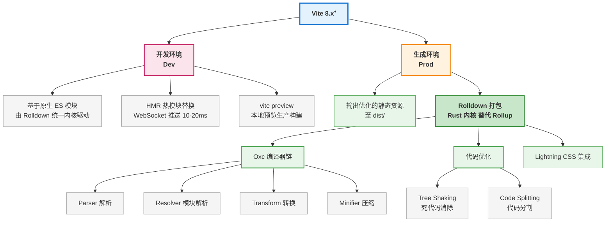

📚 开发服务器（vite dev）vs 构建指令（vite build）

| 对比维度         | 开发服务器（vite dev）                    | 构建指令（vite build）        |
| ---------------- | ----------------------------------------- | ----------------------------- |
| **官方描述**     | 基于原生 `ES（ES Module）` 模块提供源文件 | 基于`Rolldown` 打包代码       |
| **核心工作方式** | 仅按需编译 — `不打包`                     | 全量打包优化                  |
| **底层技术**     | `Rolldown`（依赖预构建/转换）             | `Rolldown + Oxc`（打包/压缩） |
| **目标**         | 开发体验：极速启动、`HMR`热更新           | 生产性能：体积小、加载快      |
| **网络请求数**   | 多（每个模块一个请求）                    | 少（几个 `bundle` 文件）      |

::: tip 注意事项
🛠 开发服务器（依赖预构建）

> - **旧版 Vite（v6.x<sup>-</sup>）**：依赖预构建使用的是 `esbuild`。
> - **新版 Vite（v8.x）**：依赖预构建使用的是 `Rolldown`（esbuild 已被废弃）

✨ 代码构建
> - **Tree Shaking 死代码消除**：自动移除未引用的代码（比如导入却未使用）

:::

📙 开发服务器启动流程

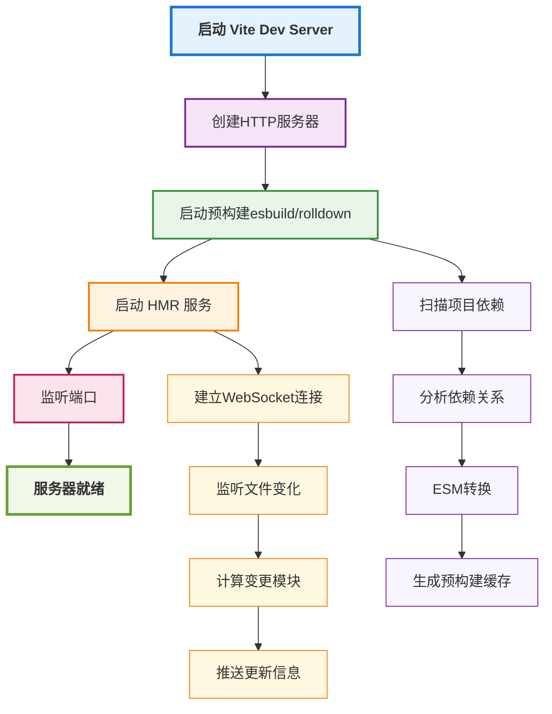

🚀 技术演进：Vite 8⁻ vs Vite 8

| 对比维度                | Vite 8.0⁻                                                          | Vite 8.0                                            |
| ----------------------- | ------------------------------------------------------------------ | --------------------------------------------------- |
| **开发服务器工作模式**  | 原生 `ESM` + 按需编译 + `HMR`                                      | 原生 `ESM` + 按需编译 + `HMR`                       |
| **开发-依赖预构建工具** | `esbuild`（Go 编写）                                               | `Rolldown`（Rust 编写）                             |
| **开发-代码转换工具**   | `esbuild`（Go 编写）                                               | `Rolldown` / `Oxc`（Rust 编写）                     |
| **生产构建工具**        | `Rollup`（JS 编写）                                                | `Rolldown`（Rust 编写）                             |
| **架构特点**            | 双引擎架构：<br/>- 开发构建用 `esbuild`<br/> - 生产构建用 `Rollup` | 统一引擎：`Rolldown`<br/>开发与生产底层统一为 `Rolldown`      |
| **配置文件**            | `build.rollupOptions`                                              | `build.rolldownOptions`<br/>（`Rollup` 选项仍兼容） |
| **构建速度**            | 快                                                                 | 相比还快 10-30 倍                                   |

#### Webpack

1️⃣ 整体架构
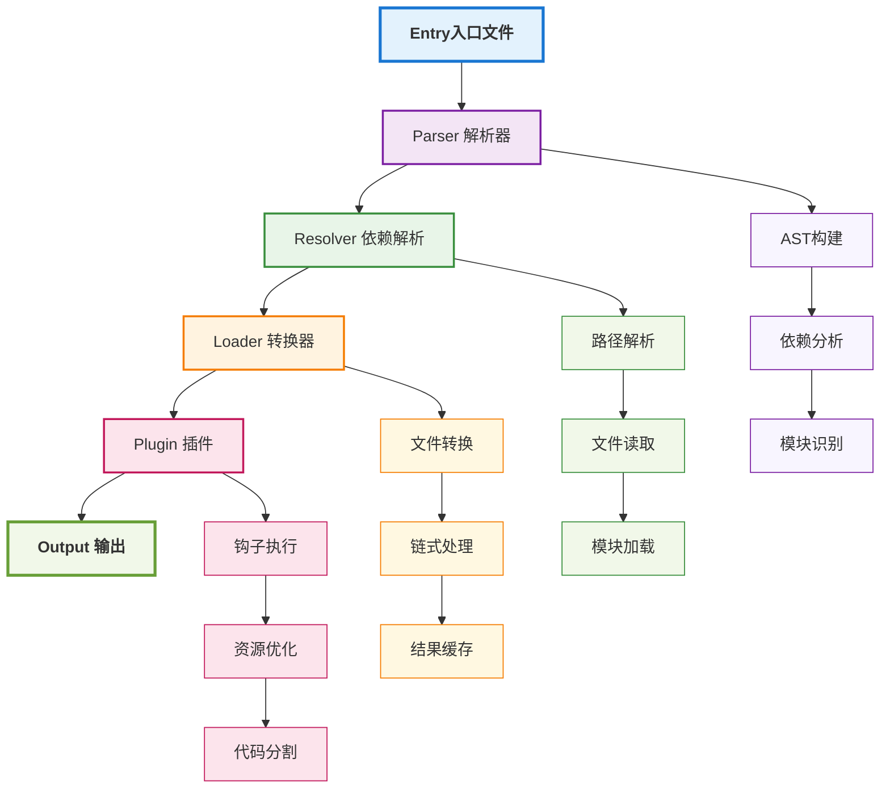

2️⃣ Webpack 的核心机制

- **模块化系统**：一切皆模块的设计理念
- **Loader机制**：灵活的模块转换能力
- **Plugin系统**：强大的扩展和定制能力
- **依赖图分析**：智能的依赖关系处理
- **代码分割**：灵活的代码分割策略

3️⃣ Webpack 注意事项

::: tip 注意事项
- loader：做 `“ 文件转换 ”` 的规则系统
> - 其价值在于把`非 JS 资源`转换成`可被 import 的 JS 模块`，从而让它也能进入依赖图参与打包。
> - 像 `CSS/图片/字体/TS` 等资源，必须先经过 `loader` 转换，才能被纳入 `Webpack` 的模块依赖图。

- loader vs plugin
> - **loader**：面向 **某类文件** 的转换（把 A → B）
> - **plugin**：面向 **整个构建过程** 的扩展（在 hooks 上做事）

:::

#### 打包/构建工具速查

1️⃣ 工具速查
- Babel
> `JS/TS/JSX` 的 `“语法转译器”`，把`新语法/语法糖`转成目标环境可运行的 JS。
- tsc（TypeScript Compiler）
> - 将 TS 编译为 JS，并提供 `类型检查`，专注于 ts 编译
> - tsc 的`转译 ≠ 打包`（不会做依赖合并、分包等）
- tsup
> 面向 TypeScript 库的`零配置打包器`（通常基于 esbuild），目标是快速产出 ESM/CJS、声明文件等。
- Webpack
> 通用`模块打包器`，能把 JS/CSS/图片/字体等 纳入依赖图，输出一个/多个 bundle，并支持强大的插件生态。
- Vite
> 以开发体验为核心的前端构建工具
> - 开发阶段利用 `原生 ESM` 快速启动，预构建利用 `esbuild/Rolldown` 进行构建
> - 生产阶段利用 `Rollup/Rolldown` 进行打包
- Rollup
> 更偏向`库（Library）打包`的打包器，擅长产出干净的 ESM/CJS 包，Tree Shaking 效果好。
- esbuild
> 基于 Go 的高性能`打包/转译`工具，特点是“极快”。
- Rspack
> 基于 Rust 的高性能打包器，目标是`尽可能兼容 Webpack 生态与配置`，同时显著提升构建速度。
- Turborepo（Turbo）
> Monorepo 的任务编排/缓存系统（不是打包器），解决“多包、多任务”的增量构建与复用。

2️⃣ 分类
- 语法转译器：Babel（也常用于处理 JSX/语法降级），不负责“完整类型检查”
- 类型检查/TS 编译器：tsc（类型检查，强在类型系统与产出 d.ts），“转译”不等于打包
- 应用打包器：Webpack、Rspack、Vite
- 库打包器：Rollup、tsup（强 tree-shaking、产出干净）
- 高性能打包/转译内核：esbuild（常被上层工具复用）
- 任务编排/增量缓存：Turborepo（面向 Monorepo 工作流）

### 前端工程 — 代码规范

统一编码风格与质量标准

> - `ESLint` 语法检查
> - `Prettier` 格式化
> - `Stylelint` 样式校验
> - `commitlint` 提交信息规范

### 前端工程 — 测试

验证代码正确性与稳定性

> - 单元测试（`Vitest`/`Jest`）
> - 组件测试
> - 端到端测试（`Playwright`/`Cypress`）

### 前端工程 — 版本控制

> 代码变更追踪与团队协作：`Git` 工作流（`Git Flow`/`Trunk-Based`）、分支策略、提交规范、`Code Review`

### 前端工程 — CI/CD

> 自动化集成与交付：推送代码后自动构建、测试、部署到目标环境（`GitHub Actions`/`GitLab CI`/`Jenkins`）

### 前端工程 — 性能优化

> 提升页面加载速度与运行时性能：首屏优化、懒加载、缓存策略、`CDN`、资源压缩、渲染优化

#### 代码分割策略

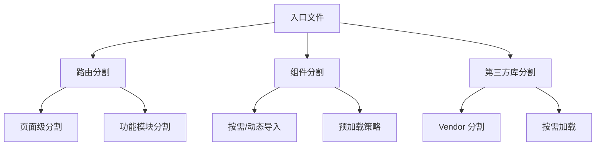

### 前端工程 — 监控

> 线上应用的可观测性：错误追踪（`Sentry`）、性能指标采集、用户行为埋点、日志系统

### 前端工程 — 安全

> 前端安全防护：`XSS` 防御、`CSRF` 防护、`CSP` 策略、依赖漏洞审计、敏感信息加密

### 前端工程 — 架构设计

> 项目整体技术方案：目录结构设计、分层架构、状态管理、路由设计、多端复用策略、微前端

#### 架构设计整体流程图

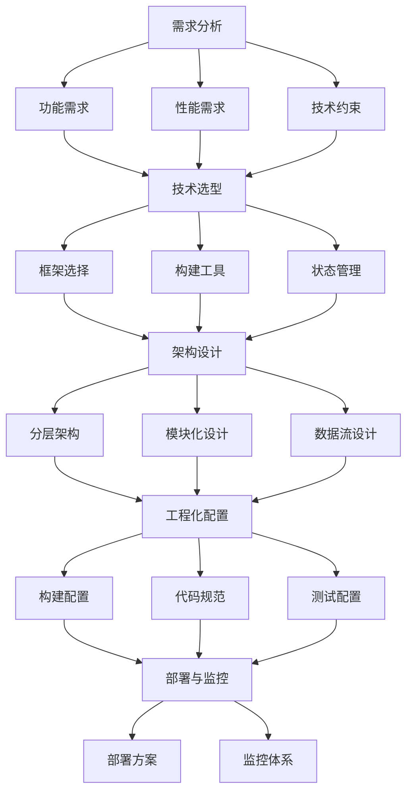

#### 架构设计整体流程说明

- **第一阶段：需求分析**

> - 功能需求：明确项目功能需求和业务目标
> - 性能需求：确定性能指标和用户体验要求
> - 技术约束：识别技术约束和限制条件

- **第二阶段：技术选型**

> - 框架选择：选择合适的开发框架和库
> - 构建工具：确定构建工具和开发环境
> - 状态管理：选择状态管理方案

- **第三阶段：架构设计**

> - 分层设计：设计分层架构和模块划分
> - 数据流设计：规划组件结构和数据流
> - 接口设计：定义接口规范和通信机制

- **第四阶段：工程化配置**

> - 配置构建流程和优化策略
> - 建立代码规范和开发流程
> - 设置测试框架和CI/CD

- **第五阶段：部署与监控**

> - 部署方案：制定部署策略和发布流程
> - 监控体系：建立性能监控和错误追踪

#### 架构设计原则

- 单一职责原则 (SRP)
  > 每个模块或组件应该只有一个引起它变化的原因。
- 开闭原则 (OCP)
  > 软件实体应该对扩展开放，对修改关闭。
- 依赖倒置原则 (DIP)
  > 高层模块不应该依赖低层模块，两者都应该依赖抽象。

#### 目录结构设计

::: code-group

```sh [Monorepo 目录结构]
project-root/
├── packages/                       # 包目录
│   ├── app/                        # 主应用包
│   │   ├── src/
│   │   │   ├── components/         # 应用组件
│   │   │   ├── pages/              # 页面组件
│   │   │   ├── services/           # 应用服务
│   │   │   ├── types/              # 类型定义
│   │   │   └── index.ts            # 入口文件
│   │   ├── public/                 # 静态资源
│   │   ├── package.json            # 包配置
│   │   └── tsconfig.json           # TypeScript配置
│   ├── ui/                         # UI组件库包
│   │   ├── src/
│   │   │   ├── components/         # UI组件
│   │   │   ├── hooks/              # 自定义Hooks
│   │   │   ├── types/              # 类型定义
│   │   │   └── index.ts            # 入口文件
│   │   ├── package.json            # 包配置
│   │   └── tsconfig.json           # TypeScript配置
│   ├── utils/                      # 工具函数包
│   │   ├── src/
│   │   │   ├── string/             # 字符串工具
│   │   │   ├── date/               # 日期工具
│   │   │   ├── array/              # 数组工具
│   │   │   ├── types/              # 类型定义
│   │   │   └── index.ts            # 入口文件
│   │   ├── package.json            # 包配置
│   │   └── tsconfig.json           # TypeScript配置
│   └── api/                        # API客户端包
│       ├── src/
│       │   ├── client/             # API客户端
│       │   ├── types/              # API类型定义
│       │   ├── interceptors/       # 拦截器
│       │   └── index.ts            # 入口文件
│       ├── package.json            # 包配置
│       └── tsconfig.json           # TypeScript配置
├── apps/                           # 应用目录（可选）
│   ├── web/                        # Web应用
│   │   ├── src/
│   │   ├── public/
│   │   └── package.json
│   └── mobile/                     # 移动端应用
│       ├── src/
│       └── package.json
├── tools/                          # 工具目录
│   ├── eslint-config/              # ESLint配置
│   ├── typescript-config/          # TypeScript配置
│   └── build-tools/                # 构建工具
├── docs/                           # 文档目录
├── package.json                    # 根包配置
├── lerna.json                      # Lerna配置（如果使用）
├── nx.json                         # Nx配置（如果使用）
├── tsconfig.json                   # 根TypeScript配置
├── .eslintrc.js                    # ESLint配置
├── .prettierrc                     # Prettier配置
└── README.md                       # 项目说明
```

```sh [功能模块化目录结构-单仓库]
project-root/
├── src/
│   ├── modules/                     # 功能模块目录
│   │   ├── user/                    # 用户模块
│   │   │   ├── components/          # 用户相关组件
│   │   │   ├── services/            # 用户相关服务
│   │   │   ├── types.ts             # 用户相关类型定义
│   │   │   ├── utils.ts             # 用户相关工具函数
│   │   │   └── index.ts             # 模块入口文件
│   │   ├── product/                 # 产品模块
│   │   │   ├── components/          # 产品相关组件
│   │   │   ├── services/            # 产品相关服务
│   │   │   ├── types.ts             # 产品相关类型定义
│   │   │   ├── utils.ts             # 产品相关工具函数
│   │   │   └── index.ts             # 模块入口文件
│   │   └── order/                   # 订单模块
│   │       ├── components/          # 订单相关组件
│   │       ├── services/            # 订单相关服务
│   │       ├── types.ts             # 订单相关类型定义
│   │       ├── utils.ts             # 订单相关工具函数
│   │       └── index.ts             # 模块入口文件
│   ├── shared/                      # 公共资源目录
│   │   ├── components/              # 公共组件
│   │   ├── services/                # 公共服务
│   │   ├── types.ts                 # 公共类型定义
│   │   ├── utils.ts                 # 公共工具函数
│   │   ├── hooks.ts                 # 公共Hooks
│   │   ├── constants.ts             # 公共常量
│   │   └── styles/                  # 公共样式
│   ├── app/                         # 应用核心目录
│   │   ├── components/              # 应用级组件
│   │   ├── store/                   # 状态管理
│   │   ├── router/                  # 路由配置
│   │   └── config.ts                # 应用配置
│   ├── pages/                       # 页面组件目录
│   └── index.ts                     # 应用入口文件
├── public/                          # 静态资源目录
├── config/                          # 配置文件目录
├── tests/                           # 测试文件目录
├── docs/                            # 文档目录
├── package.json                     # 项目配置
├── tsconfig.json                    # TypeScript配置
├── .eslintrc.js                     # ESLint配置
├── .prettierrc                      # Prettier配置
└── README.md                        # 项目说明
```

:::

### 工程化与编译原理

#### 📚 学习目标

- 掌握传统编译流程和前端编译流程的区别
- 理解词法分析、语法分析、语义分析等核心概念
- 学会应用编译原理优化构建流程

#### 编译原理概述

> 编译原理在前端工程化中扮演着核心角色。理解编译原理有助于我们更好地使用和优化构建工具，解决复杂的工程化问题

#### 编译流程整体架构

1️⃣ 传统编译流程

```txt
源代码 → 词法分析 → 语法分析 → 语义分析 → 中间代码生成 → 代码优化 → 目标代码生成
```

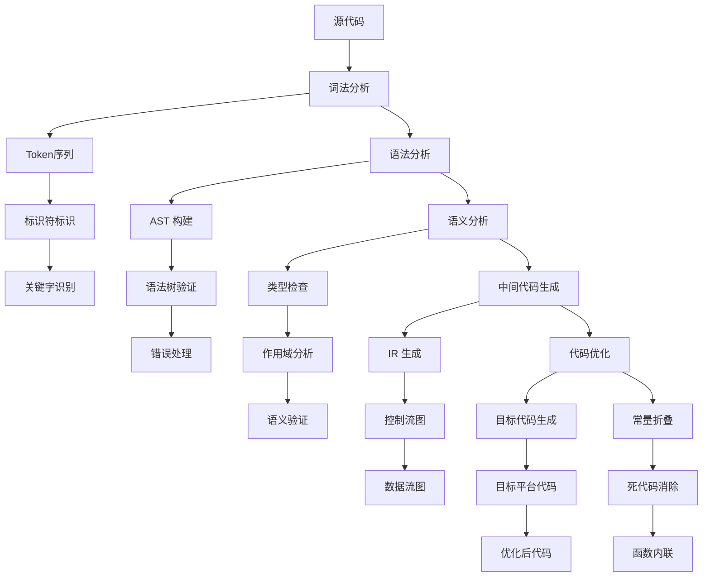

2️⃣ 前端编译流程

```txt
源代码 → 代码解析(Parse) → 代码转换(Code Transformation) → 代码生成(Code Generation)
```

<FeCompileFlow />

#### 编译阶段详细流程

1️⃣ 词法分析阶段

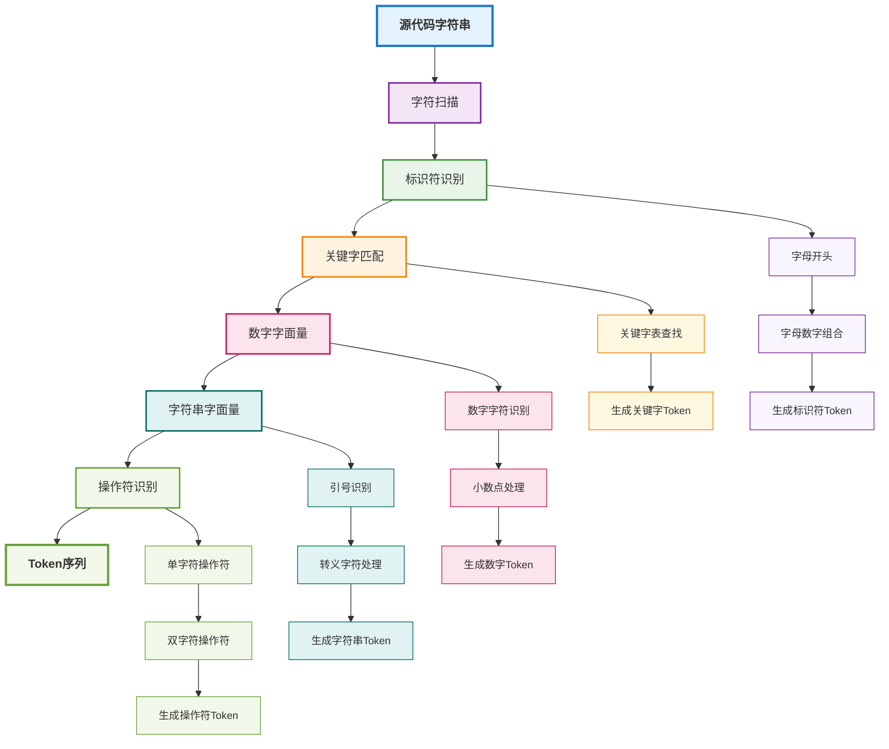

2️⃣ 语法分析阶段

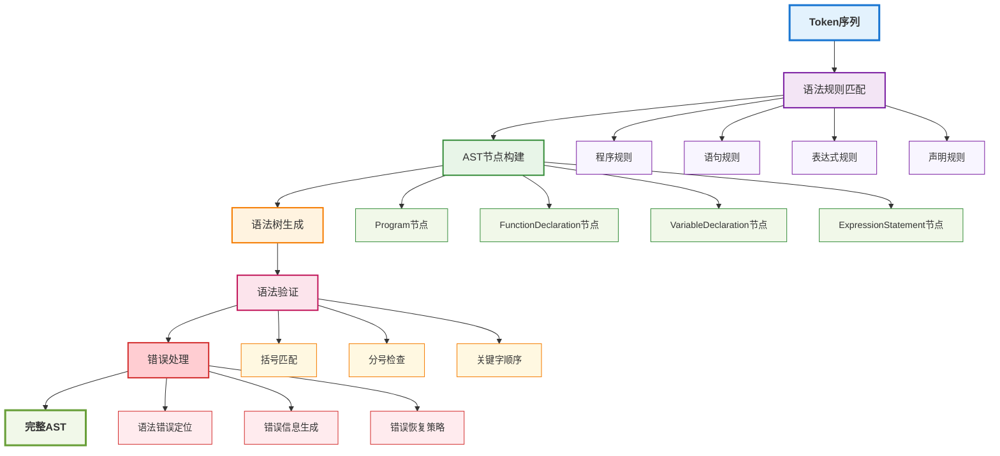

3️⃣ 语义分析

```mermaid
flowchart TD
    %% 主要流程 - 垂直布局，链路清晰
    A[AST-抽象语法树] --> B[作用域分析]
    B --> C[类型检查]
    C --> D[语义验证]
    D --> E[符号表构建]
    E --> F[语义正确的AST]

    %% 作用域分析子流程 - 右侧展开
    B --> B1[全局作用域]
    B --> B2[函数作用域]
    B --> B3[块级作用域]
    B1 --> B4[变量声明检查]
    B2 --> B5[参数作用域]
    B3 --> B6[临时变量作用域]

    %% 类型检查子流程 - 右侧展开
    C --> C1[基本类型检查]
    C --> C2[函数类型检查]
    C --> C3[数组类型检查]
    C --> C4[对象类型检查]
    C1 --> C5[类型兼容性]
    C2 --> C6[参数类型匹配]

    %% 语义验证子流程 - 右侧展开
    D --> D1[变量使用前声明]
    D --> D2[函数调用匹配]
    D --> D3[表达式类型一致]
    D --> D4[控制流完整性]

    %% 符号表子流程 - 右侧展开
    E --> E1[变量符号]
    E --> E2[函数符号]
    E --> E3[类型符号]
    E --> E4[作用域链]

    %% 样式设置 - 主流程突出显示
    style A fill:#e3f2fd,stroke:#1976d2,stroke-width:3px,font-weight:bold
    style F fill:#f1f8e9,stroke:#689f38,stroke-width:3px,font-weight:bold

    %% 主流程节点样式
    style B fill:#f3e5f5,stroke:#7b1fa2,stroke-width:2px
    style C fill:#e8f5e8,stroke:#388e3c,stroke-width:2px
    style D fill:#fff3e0,stroke:#f57c00,stroke-width:2px
    style E fill:#fce4ec,stroke:#c2185b,stroke-width:2px

    %% 子流程样式 - 淡化处理
    style B1 fill:#f8f5ff,stroke:#7b1fa2,stroke-width:1px,font-size:14px
    style B2 fill:#f8f5ff,stroke:#7b1fa2,stroke-width:1px,font-size:14px
    style B3 fill:#f8f5ff,stroke:#7b1fa2,stroke-width:1px,font-size:14px
    style B4 fill:#f8f5ff,stroke:#7b1fa2,stroke-width:1px,font-size:14px
    style B5 fill:#f8f5ff,stroke:#7b1fa2,stroke-width:1px,font-size:14px
    style B6 fill:#f8f5ff,stroke:#7b1fa2,stroke-width:1px,font-size:14px
    style C1 fill:#f1f8e9,stroke:#388e3c,stroke-width:1px,font-size:14px
    style C2 fill:#f1f8e9,stroke:#388e3c,stroke-width:1px,font-size:14px
    style C3 fill:#f1f8e9,stroke:#388e3c,stroke-width:1px,font-size:14px
    style C4 fill:#f1f8e9,stroke:#388e3c,stroke-width:1px,font-size:14px
    style C5 fill:#f1f8e9,stroke:#388e3c,stroke-width:1px,font-size:14px
    style C6 fill:#f1f8e9,stroke:#388e3c,stroke-width:1px,font-size:14px
    style D1 fill:#fff8e1,stroke:#f57c00,stroke-width:1px,font-size:14px
    style D2 fill:#fff8e1,stroke:#f57c00,stroke-width:1px,font-size:14px
    style D3 fill:#fff8e1,stroke:#f57c00,stroke-width:1px,font-size:14px
    style D4 fill:#fff8e1,stroke:#f57c00,stroke-width:1px,font-size:14px
    style E1 fill:#fce4ec,stroke:#c2185b,stroke-width:1px,font-size:14px
    style E2 fill:#fce4ec,stroke:#c2185b,stroke-width:1px,font-size:14px
    style E3 fill:#fce4ec,stroke:#c2185b,stroke-width:1px,font-size:14px
    style E4 fill:#fce4ec,stroke:#c2185b,stroke-width:1px,font-size:14px
```

#### 完整编译流程回顾

1️⃣ 完整编译流程图

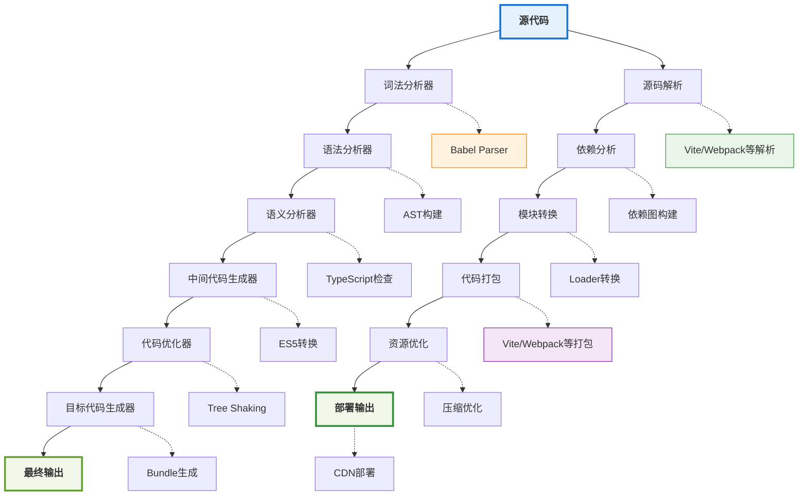

2️⃣ 传统编译流程 vs 前端工程化流程（精准映射）

| 传统编译阶段     | 工程化对应技术                 | 典型工具             | 核心作用                              |
| ---------------- | ------------------------------ | -------------------- | ------------------------------------- |
| **词法分析**     | 源码字符串 → Token 序列        | Babel parser/esbuild | 将代码拆解为最小语义单元              |
| **语法分析**     | Token 序列 → AST（抽象语法树） | @babel/parser, swc   | 建立代码的结构化表示                  |
| **语义分析**     | 类型检查、作用域解析、变量绑定 | TS Compiler/ESLint   | 保证代码逻辑正确性                    |
| **中间代码生成** | 源码 → 目标环境代码（ES5/ES6） | Babel 转换/swc       | 实现降级、特性转换                    |
| **代码优化**     | 死码消除、内联、常量折叠       | Terser/Tree Shaking  | 减少体积、提升运行性能                |
| **目标代码生成** | 最终产物（Bundle / Chunk）     | Webpack/Vite/Rollup  | 组织模块、适配不同环境（浏览器/Node） |

3️⃣ 编译原理与构建工具的对应关系（含详细备注）

| 编译阶段          | 构建工具   | 具体实现                               | 备注                                                                                                                                                                                                                             |
| ----------------- | ---------- | -------------------------------------- | -------------------------------------------------------------------------------------------------------------------------------------------------------------------------------------------------------------------------------- |
| **词法分析**      | Babel      | @babel/parser                          | 将源代码字符串拆解成Token序列（关键字、标识符、运算符、字面量等），例 `const a = 1;` 拆分为 `[{type: 'keyword', value: 'const'}, {type: 'identifier', value: 'a'}, {type: 'operator', value: '='}, {type: 'numeric', value: 1}]` |
| **语法分析**      | TypeScript | ts.parse()                             | 将Token序列按照语法规则组织成AST（抽象语法树），同时进行语法正确性校验。                                                                                                                                                         |
| **语义分析**      | ESLint     | AST 遍历规则                           | 在AST基础上进行上下文分析：检查未定义变量、重复定义、作用域泄漏、类型不匹配等。                                                                                                                                                  |
| **中间代码/转换** | Webpack    | Loader系统（如babel-loader,ts-loader） | 将源码转换为中间形态或目标形态。例如通过babel-loader将ES6+代码转为ES5，或通过css-loader处理CSS导入关系                                                                                                                           |
| **代码优化**      | Rollup     | Tree Shaking                           | 基于ES Module静态结构，分析`import/export`依赖图，消除未被引用的导出（Dead Code Elimination）。例如模块导出了10个函数但只用了1个，其余9个不会进入bundle                                                                          |
| **代码生成**      | Vite       | esbuild / Rollup（生产环境）           | 将优化后的中间表示转换为最终的目标代码，并组织成可部署的bundle或chunk。开发环境用esbuild极速预构建依赖，生产环境用Rollup生成优化后的静态资源                                                                                     |

## multi-repo vs mono-repo

### 两种代码风格仓库

- `multi-repo`（单仓库）：把每个项目都分别用 `git` 托管
- `mono-repo`（多仓库）：统一用一个 `git` 仓库管理所有的项目

### 单/多仓库目录

::: code-group

```js [multi-repo.js]
root
|── project-a
|   ├── ...
|   └── .git
├── project-b
|   ├── ...
|   └── git
├── project-c
|   ├── ...
|   └── .git
├── project-d
|   ├── ...
|   └── .git
...
```

```js [mono-repo.js]
├── .git
├── lerna.json
├── package.json
├── packages
    ├── project-a
    |    ├── README.md
    |    ├── __tests__
    |    ├── lib
    |    └── package.json
    ├── project-b
    |    ├── README.md
    |    ├── __tests__
    |    ├── lib
    |    └── package.json
    ├── project-c
        ├── README.md
        ├── __tests__
        ├── lib
        └── package.json
```

:::

### 单仓库 vs 多仓库

| 单仓库                                                                | 多仓库                                                   |
| --------------------------------------------------------------------- | -------------------------------------------------------- |
| 一个组织的所有项目的代码都存储在一个中央仓库中                        | 每个服务和项目都有一个单独的仓库                         |
| 团队可以协作工作，可以看到彼此的更改                                  | 团队可以自主工作，个人的更改不会影响其他团队或项目的更改 |
| 每个人都可以访问整个项目结构                                          | 管理员可以限制对开发人员需要访问的项目或服务的访问控制   |
| 如果项目规模不断增长，可能会出现扩展问题                              | 性能良好，因为代码量有限，服务单位较小                   |
| 难以实施持续部署（CD）和持续集成（CI）                                | 开发人员可以轻松实现CD和CI，因为他们可以独立构建服务     |
| 开发人员可以轻松共享库、API和其他共享代码，因为它们在中央仓库中被更新 | 应定期同步对库和其他共享代码的任何更改，以避免后续问题   |

### multi-repo 的管理

```sh [sh]
# 初始化git submodules仓库
git submodule init
# 添加一个submodule
git submodule add https://github.com
# 更新所有的submodule
git submodule update
# 查submodule status
git submodule status
# foreach 用于在每个submodule中执行命令
git submodule foreach "git checkout -b featureA"
```

### mono-repo 的管理

1️⃣ 初始化的目录结构

```sh [sh]
# 初始化的目录结构
lerna init
# 创建项目1
lerna create pac-1
# 创建项目2
lerna create pac-2
# 创建项目3
lerna create pac-3
```

2️⃣ 目录中 lerna.json

```json [json]
{
  // 配置$schema可以在vscode中，鼠标滑倒每个配置项时候，可以看每个配置项的介绍
  // 可以在https://www.schemastore.org/json/中网站查看知名项目的描述文件
  "$schema": "http://json.schemastore.org/lerna",
  "packages": ["packages/*"],
  "version": "independent" // 可以给各个项目发不同的版本
}
```

3️⃣ 添加项目依赖

```sh [sh]
# 制造依赖关系，对于内部项目的依赖，lerna会以软链接的形式，给它们相互软链接起来
lerna add pac-1 packages/pac-2
lerna add pac-2 packages/pac-3
```

4️⃣ lerna.json 配置

```json [json]
{
  "version": "0.0.0",
  "npmClient": "npm",
  "npmClientArgs": ["--pure-lockfile"],
  "command": {
    "publish": {
      "ignoreChanges": ["ignored-file", "*.md"],
      "message": "chore(replease):publish",
      "registry": "https://npm.pkg.github.com"
    },
    "bootstrap": {
      "ignore": "component-*",
      "npmClientArgs": ["--no-package-lock"]
    }
  },
  "packages": ["packages/*"]
}
```

## Monorepo vs Polyrepo

### 在软件开发体系中的位置

```sh
软件开发工程
├── 需求分析
├── 架构设计（架构模式：微服务、单体、分层等）
├── 代码组织 ◄──── Monorepo vs Polyrepo 在这里
│   ├── 代码仓库管理策略（Monorepo / Polyrepo）
│   ├── 模块划分
│   └── 依赖管理
├── 开发流程（Git Flow、主干开发等）
├── 构建与部署（CI/CD）
├── 测试策略
└── 运维监控
```

### Polyrepo

> ‌Polyrepo‌ 是指每个`项目/库/微服务`拥有独立且隔离的代码仓库 — **单仓库单项目**

::: tip ⚜ Polyrepo‌（Polygon Repository 称多仓库） 本质 — 单仓库单项目。
:::

### Monorepo

> ‌Monorepo‌ 是指将多个相关的`项目/库/应用`集中存储在一个代码仓库中 — **单仓库多项目**

::: tip ⚜ Monorepo（Monolithic Repository 称单体仓库） 本质 — 单仓库多项目。
:::

### 多维度深度对比

| 维度         | Polyrepo (多仓库)                                      | Monorepo (单仓库)                                           |
| ------------ | ------------------------------------------------------ | ----------------------------------------------------------- |
| ‌代码复用‌   | 需发布 npm 包或复制粘贴，存在版本滞后。                | 直接通过 workspace 引用源码，实时同步。                     |
| ‌依赖管理‌   | 各仓库独立安装，存在大量重复依赖，磁盘占用高。         | 依赖提升到根目录，全局去重，节省空间。                      |
| ‌跨项目改动‌ | 修改公共库需分别克隆 N 个仓库，手动升级版本，易出错。  | 原子化提交，一次修改同时更新所有受影响项目。                |
| ‌权限控制‌   | 粒度精细，可按仓库隔离敏感信息。                       | 需借助 CODEOWNERS 实现目录级权限，配置较复杂。              |
| ‌CI/CD 效率‌ | 每个仓库单独构建，资源分散，无法利用缓存加速关联项目。 | 支持增量构建，仅构建受影响部分，可并行执行。                |
| ‌学习成本‌   | 低，各项目独立，符合直觉。                             | 高，需掌握 Workspaces、任务编排、拓扑排序等概念。           |
| ‌仓库体积‌   | 单个仓库小，克隆速度快。                               | 仓库随时间膨胀，克隆耗时较长（可通过 Shallow Clone 优化）。 |

### 选择 Polyrepo 与 Monorepo

1️⃣ 何时选择 Polyrepo？

- ‌**团队高度自治**‌：不同团队负责完全独立的产品，极少共享代码。
- ‌**技术栈差异大**‌：各项目使用完全不同的语言或构建工具，难以统一配置。
- ‌**权限要求严格**‌：涉及敏感数据，需要严格的物理隔离。
- ‌**小型项目或个人开发**‌：维护 Monorepo 的工具链成本高于其带来的收益。

2️⃣ 何时选择 Monorepo？

- **‌高频代码共享‌**：多个应用共用 UI 组件库、工具函数、类型定义。
- **‌紧密协作团队**‌：需要频繁进行跨模块重构或原子化变更。
- **‌统一工程标准**‌：希望强制统一 ESLint、Prettier、TypeScript 配置及测试规范。
- **‌中大型前端工程**‌：包含 Web、小程序、Node 服务等多个端，且依赖关系复杂。

## 参考资源

- [《前端工程化概述》 - 张云龙](https://github.com/fouber/blog)
- [前端学习指南 - 完整的前端开发教程](https://specialxm.github.io/frontend-learning-guide/)
- [深入浅出 Webpack](https://pasoul.github.io/dive-into-webpack/)
