# 高级进阶

## 软件架构设计模式

> [MVC，MVP 和 MVVM 的图示 - 阮一峰的网络日志](https://www.ruanyifeng.com/blog/2015/02/mvcmvp_mvvm.html)

### 发展进程

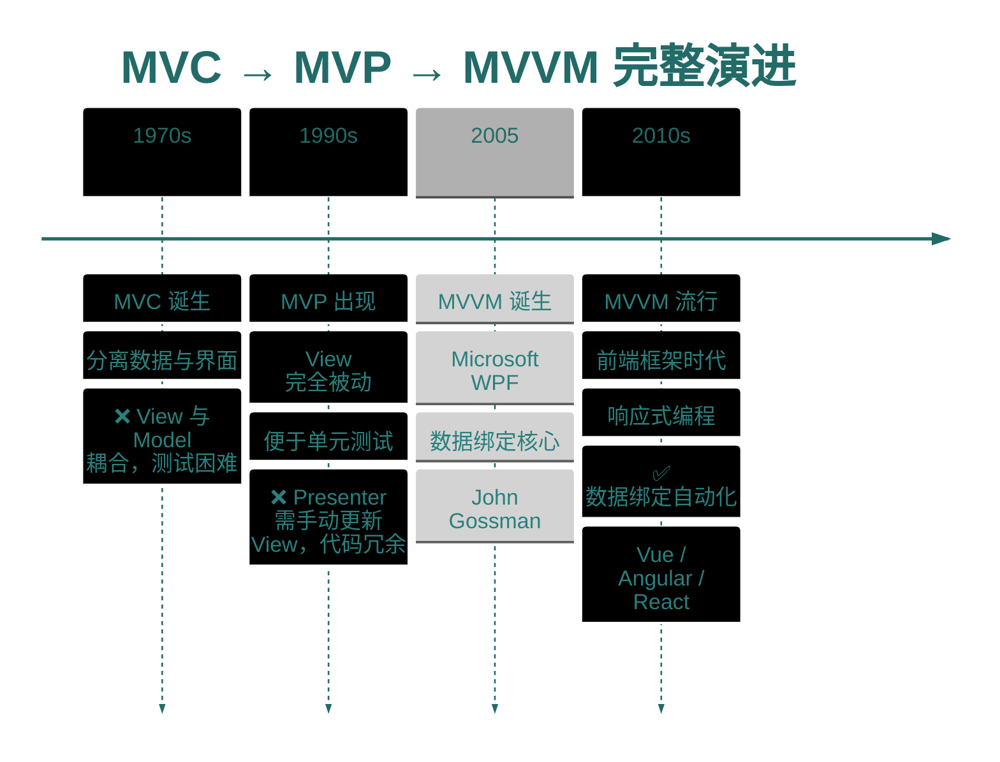

### MVC

1️⃣ 架构图详细版（带步骤编号）
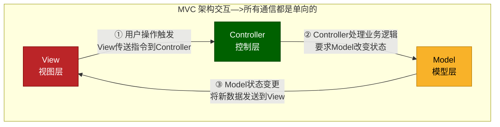
2️⃣ 架构图（带用户角色的完整流程图）

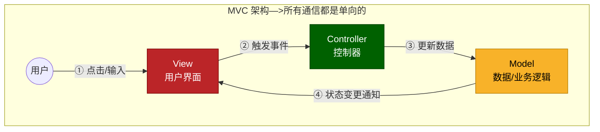

3️⃣ 带时序的完整 MVC 交互图
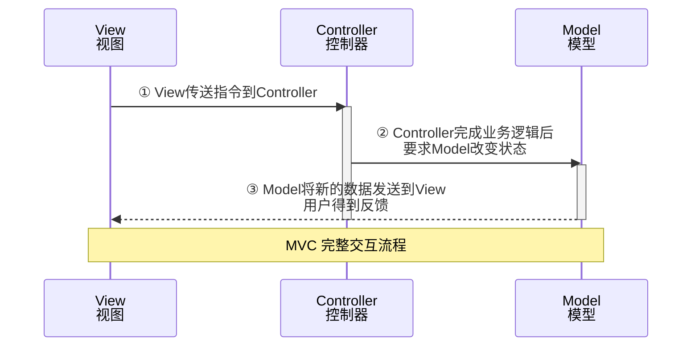

4️⃣ 核心组成
- MVC（Model-View-Controller）
  > - `Model`：数据、业务逻辑、状态管理
  > - `View`：UI 展示，接收用户输入
  > - `Controller`：接收用户请求，调用 Model，更新 View

### MVP

1️⃣ 架构图详细版（带步骤编号）

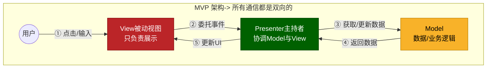

2️⃣ 架构图（带用户角色的完整流程图）

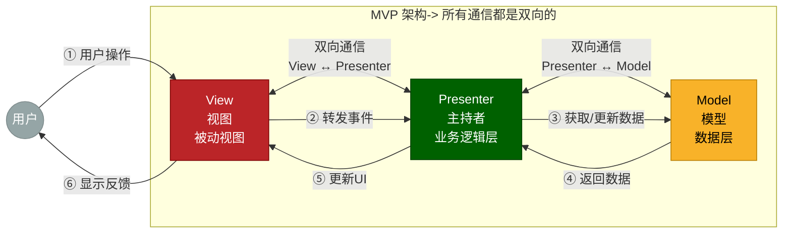

3️⃣ 时序图版本（更清晰展示双向通信）
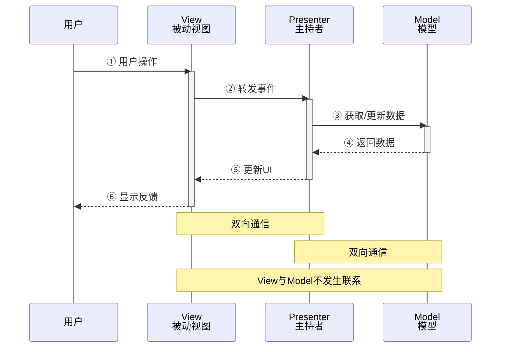

4️⃣ 核心组成
- MVP（Model-View-Presenter）
  > - `Model`：数据、业务逻辑
  > - `View`：UI 展示，`被动`接收 Presenter 指令，不主动处理逻辑
  > - `Presenter`：中间协调者，从 View 接收用户动作，调用 Model，更新 View

### MVVM
1️⃣ 架构图详细版（带步骤编号）

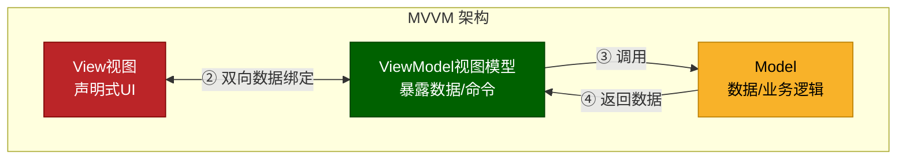

2️⃣ 架构图（带用户角色的完整流程图）
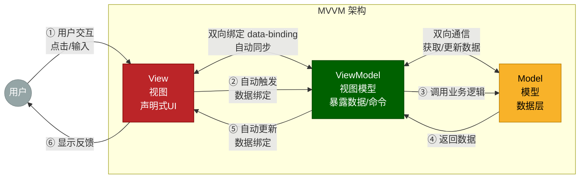

3️⃣ 时序图版本（更清晰展示双向通信）
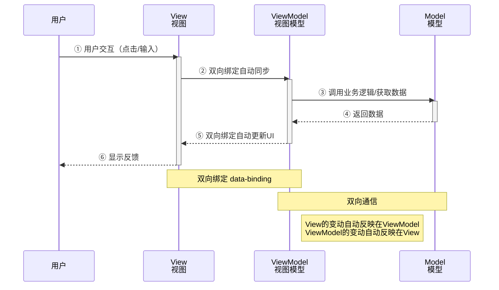

4️⃣ 核心组成
- MVVM（Model-View-ViewModel）
  > - `Model`：数据、业务逻辑
  > - `View`：UI 展示，`声明式`绑定 ViewModel 的属性
  > - `ViewModel`：暴露数据和命令，负责协调 Model 和 View，通过`数据绑定`自动同步 View

### 对比总结

1️⃣ 总结对比表

| 模式 | 职责划分                                 | 测试性 | 复杂度 | 典型场景          |
| ---- | ---------------------------------------- | ------ | ------ | ----------------- |
| MVC  | View 接收输入，Controller 响应           | 中     | 中     | 传统 Web 框架     |
| MVP  | View 完全被动，Presenter 全权负责        | 高     | 较高   | Android、桌面应用 |
| MVVM | 数据绑定自动同步，ViewModel 无 View 引用 | 高     | 中高   | 现代前端框架、WPF |

2️⃣ 核心区别总结图
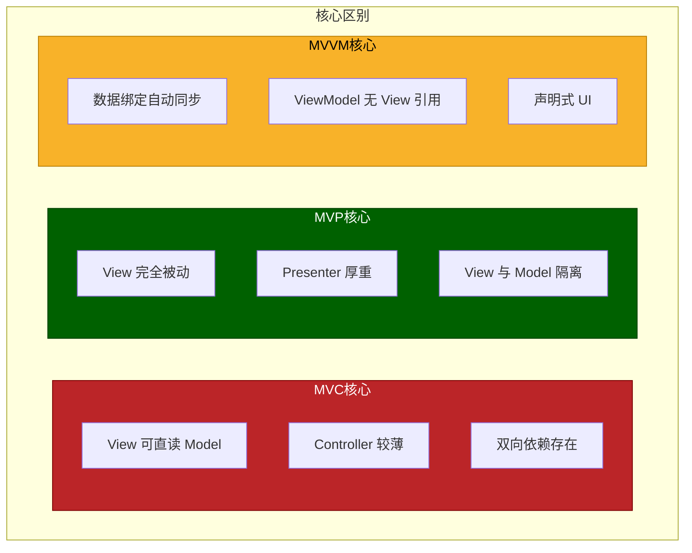