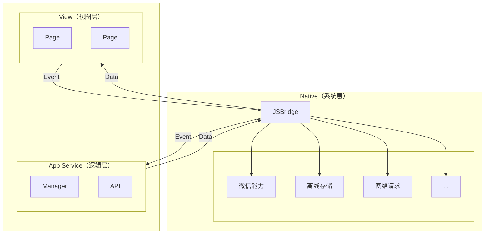
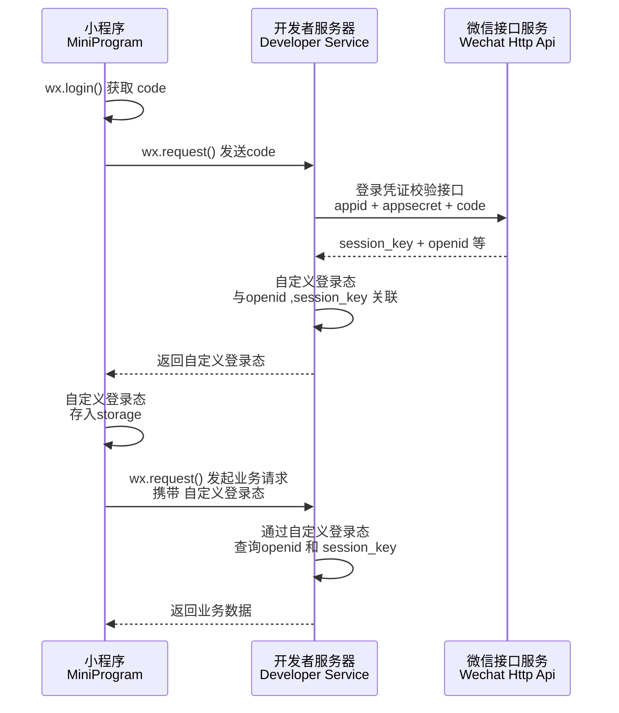
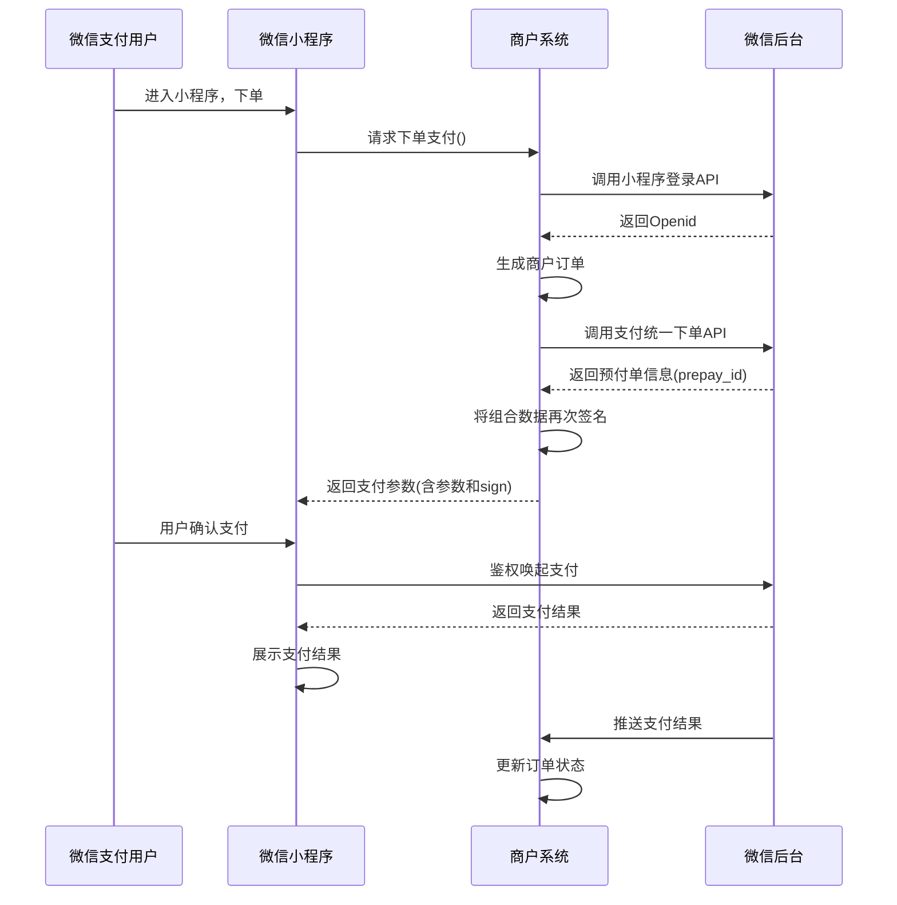
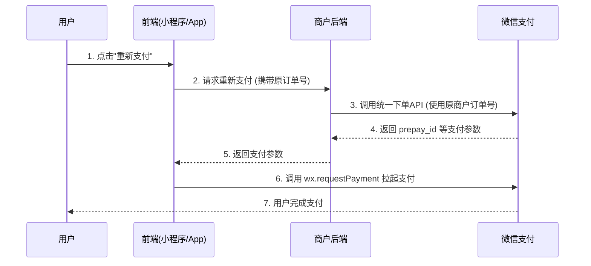

# 小程序系列

## 微信小程序

### 上线前准备

#### 流程步骤预览

- 第一步：小程序发布前准备
  - 完善基础信息
  - 代码开发与调试
  - 备案（域名备案、小程序备案、公安备案_可选）与认证（企业认证）
- 第二步：版本管理
> 在微信开发者工具上传代码，然后选择版本提交审核，审核通过后的版本可发布。

#### 备案说明

1️⃣ **备案类型**

- 1、域名备案（ICP备案）
- 2、公安备案
- 3、小程序备案（不同平台需要各自备案：微信、抖音、支付宝等等）

2️⃣ **总结对照**

| 备案类型    | 是否必须         | 备案对象    | 办理渠道                    | 大致耗时     |
| :---------- | :--------------- | :---------- | :-------------------------- | :----------- |
| 域名ICP备案 | **必须**         | 域名        | 云服务商（阿里云/腾讯云等） | 7-20个工作日 |
| 小程序备案  | **必须**         | 小程序      | 微信/支付宝/抖音平台        | 1-5个工作日  |
| 公安备案    | **有后端则必须** | 服务器/网站 | 全国互联网安全管理服务平台  | 1-3个工作日  |

**一句话建议**：如果你用的是国内服务器，那么**域名ICP备案 + 小程序备案 + 公安备案**这三项一个都不能少。公安备案虽然不直接卡小程序上线，但属于必须履行的法定义务，建议在ICP备案通过后一并办理。

#### 各家小程序备案

开发者自行到各家小程序管理控制台上传相关信息，即可完成，不涉及域名及固定IP等要素。 

1️⃣ **小程序备案参考资料**

- [微信小程序备案操作指引](https://developers.weixin.qq.com/miniprogram/product/record/record_guidelines.html)
- [支付宝小程序备案操作指引](https://opendocs.alipay.com/mini/0apy22?pathHash=2cd5467d)
- [抖音小程序ICP备案指引](https://developer.open-douyin.com/docs/resource/zh-CN/mini-app/operation/settle/ICPFiling/ICPintroduce)
- [小红书小程序备案流程](https://miniapp.xiaohongshu.com/doc/DC896252)
- [快手小程序备案流程](https://mp.kuaishou.com/docs/operate/specification/icp/guide.html)
- [京东小程序备案流程](https://mp-docs.jd.com/doc/operation/beian/2300)
- [百度小程序备案指引](https://smartprogram.baidu.com/docs/introduction/register_filings/)

2️⃣ **小程序备案整体流程** 

备案整体流程总共分为五个环节：备案信息填写、平台初审、工信部短信核验、通管局审核和备案成功 

- 备案信息填写
  > 填写备案信息及上传材料
- 平台初审
  > - 微信 1~2个工作日内完成平台初审
  > - 抖音 1~6个工作日内完成平台初审
  > - 支付宝 1 个工作日内完成平台初审
  > - 小红书  1~2 个工作日内完成平台初审
  > - 快手  1~2 个工作日内完成平台初审
- 工信部短信核验
  > 24 小时内完成短信核验
- 通管局审核
  > 在 1~20 个工作日内完成审核，没有催审途径。
- 备案成功 
  > 管理局下发小程序备案号
- 悬挂备案号
  > 平台会自动获取小程序备案号，并在【小程序主体信息页】展示备案号，小程序开发者无需自行操作。 

### 小程序上线平台

根据需求上线不同的平台：微信、抖音、快手、百度、支付宝、小红书等等，不同平台小程序需要配置对应平台的小程序`AppID`。

### 小程序的版本

- [小程序的版本-微信官方](https://developers.weixin.qq.com/miniprogram/dev/framework/quickstart/release.html#小程序的版本)

#### 小程序版本介绍

一般的软件开发流程，编写代码自测开发版程序，直到程序达到一个稳定可体验的状态时，会把这个体验版本给到产品经理和测试人员进行体验测试，最后修复完程序的 Bug 后发布供外部用户正式使用。小程序的版本根据这个流程设计了小程序版本的概念。

| 权限       | 说明                                                                                                                                                                     |
| ---------- | ------------------------------------------------------------------------------------------------------------------------------------------------------------------------ |
| 开发版本   | 使用开发者工具，可将代码上传到开发版本中。开发版本只保留每人最新的一份上传的代码。<br>点击提交审核，可将代码提交审核。开发版本可删除，不影响线上版本和审核中版本的代码。 |
| 体验版本   | 可以选择某个开发版本作为体验版本，并且选取一份体验版。                                                                                                                   |
| 审核中版本 | 只能有一份代码处于审核中。有审核结果后可以发布到线上，也可直接重新提交审核，覆盖原审核版本。                                                                             |
| 线上版本   | 线上所有用户使用的代码版本，该版本代码在新版本代码发布后被覆盖更新。                                                                                                     |

#### 开发版/体验版备忘录极简速查

1、**核心总览**

- ✅ 开发版：真机调试，支持**通过手动“打开调试”** 临时豁免域名校验
- ✅ 体验版：准线上内测，全量严格校验，**同样可通过手动“打开调试”** 临时豁免
- 💡 重要准则：模拟器仅用于编码开发，所有问题最终以体验版真机效果为准


2、**三环境核心区别**

🔹 微信开发者工具（本地开发）
  > 本地实时代码、域名校验**可手动开启/关闭**、支持IP/HTTP、仅用于本地编码调试

🔹 真机开发版（个人自测）
  > 本地预览临时包、默认强制域名校验、跟随开发者工具本地校验配置。
  > 真机手动开启调试、仅开发者本人可使用、不支持团队测试

🔹 真机体验版（团队内测）
  > 后台固定上传包、强制域名校验、无任何豁免、不可跳过
  >
  > 不支持IP/HTTP、后台统一开启调试、仅限体验成员访问

3、**网络域名硬性规则（官方强制）**，❗ 小程序官方固定规范

- ✅ 正式/体验/真机开发生效：仅支持 **HTTPS / WSS** 协议
- ❌ 全面禁止：HTTP、内网IP、自定义端口（仅默认443端口生效）

4、**域名豁免规则说明**

- 📍 本地开发者工具：设置中勾选“不校验合法域名”即可临时跳过校验
- 📍 真机（开发版/体验版）：点击右上角「···」→ 手动“打开调试”，即可跳过校验
- ⏰ 时效：无固定期限，随调试开关的开启/关闭而生效
- ⚠️ 注意：正式版小程序无法跳过域名校验，必须配置合法HTTPS域名

5、**域名跳过校验【真实官方开启步骤】**

唯一官方跳过方案（仅本地开发+真机开发版生效）

- 📍 开启路径：微信开发者工具 → 项目「详情」→ 本地设置
- 📍 勾选选项：不校验合法域名、web-view业务域名、TLS版本、HTTPS证书
- ✅ 生效范围：开发者工具模拟器、开启调试的真机开发版
- ❌ 无效范围：体验版、正式版完全不生效
- 👤 权限属性：本地工具配置，仅当前开发者设备生效，无时效限制

6、**本地IP调试标准方案（官方合规）**

环境自动适配，兼顾开发效率与线上一致性：

- 💻 开发者工具环境 → 走本地内网接口（192.168.x.x:port，依赖本地不校验配置）
- 📱 真机环境（开发/体验） → 走后台已备案白名单 HTTPS 测试域名

7、**开发版关键要点（纯官方）**

- 1. 代码无热更新，修改后必须重新预览、扫码，才能生效
- 2. 调试日志：小程序右上角「···」手动开启 vConsole 调试
- 3. 包体限制：主包必须 ≤ 2M，超限无法生成预览码
- 4. 缓存异常：清除小程序缓存后重新扫码即可恢复

8、**体验版关键要点（纯官方）**

- 1. 代码绑定后台上传固定包，改代码必须「重新上传+后台更新体验版」
- 2. 访问权限：仅后台配置了的体验成员微信号可打开，外人无法访问
- 3. 调试日志：需后台版本管理页全局开启调试，手机无法单独开启
- 4. Web-view页面：**必须配置业务域名**，无任何跳过校验方案
- 5. 版本时效：体验版有效期90天，到期自动失效，需重新上传
- 6. 支付测试：不支持正式微信支付，测试必须使用微信支付沙箱环境
- 7. 更新异常：删除小程序、清空缓存后重新扫码即可

9、**高频报错速查修复（官方精准）**

- 🔸 模拟器正常、真机开发版报错 → 未开启本地不校验 / 未配置HTTPS白名单，真机需手动“打开调试”跳过校验
- 🔸 开发版正常、体验版全挂 → 体验版同样需手动“打开调试”以跳过校验
- 🔸 真机无报错日志 → 体验版未在后台开启全局调试开关
- 🔸 修改代码不生效 → 开发版未重扫 / 体验版未重新上传更新
- 🔸 他人无法打开体验码 → 未将对方微信号添加为体验成员

10、**标准开发上线流程（官方规范）**

- 1. 本地工具开发：开启本地不校验，适配内网IP高效编码
- 2. 真机自测调试：开发版预览，开启调试查看日志，完成功能自测
- 3. 正式内测验收：关闭本地跳过校验，配置完整HTTPS白名单，上传体验版团队测试
- 4. 上线终审：以体验版运行状态为唯一标准，无误后提交正式版审核


### h5 使用微信JSSDK的方式

- [UNI-APP 开发微信公众号（H5）JSSDK 的使用方式 — uniapp官方](https://ask.dcloud.net.cn/article/35380)
- [微信网页开发/JS-SDK — 微信官方](https://developers.weixin.qq.com/doc/service/guide/h5/jssdk.html)
- [uni-app h5 使用微信JSSDK的方式](https://ask.dcloud.net.cn/article/36813)

### 添加项目成员和体验成员

[小程序成员管理 — 微信官方文档](https://kf.qq.com/faq/170302zeQryI170302beuEVn.html)

- **添加项目成员**：需要微信公众平台的管理员添加，项目成员无法添加项目成员
- **添加体验成员**：需要微信公众平台的管理员添加，项目成员/体验成员都无法添加

### 理解微信小程序

- `微信小程序是什么`
  > 小程序是一种`不需要下载安装`即可使用的应用
- `JS-SDK`
  > 解决了移动⽹⻚能⼒不⾜的问题，通过暴露微信的接⼝使得 Web 开发者能够拥有更多的能⼒，然⽽在更多的能⼒之外，JS-SDK的模式并没有解决使⽤移动⽹⻚遇到的体验不良的问题
- `小程序与H5的区别有如下`
  > - `运⾏环境`：⼩程序基于浏览器内核重构的内置解析器
  > - `系统权限`：⼩程序能获得更多的系统权限，如⽹络通信状态、数据缓存能⼒等
  > - `渲染机制`：⼩程序的逻辑层和渲染层是分开的
- `局限`
  > 小程序可以视为`只能用微信打开和浏览的H5`
- `优点`
  > - 随时可用，用完即走，无需安装卸载
  > - 安全
  > - 开发门槛低
  > - 降低兼容性限制
- `缺点`
  > - `用户留存`：小程序的平均次日留存在13%左右，但是双周留存骤降到仅有1%
  > - `体积限制`：微信小程序只有2M的大小，这样导致无法开发大型一些的小程序
  > - `受控微信`：小程序要面对很多来自微信的限制，从功能接口，甚至到类别内容，都要接受微信的管控

### 微信小程序架构图

> 微信小程序采用`双线程架构`，渲染层与逻辑层分离，通过微信客户端（`Native`）进行中转通信



> - `逻辑层（App Service）`：包含 `manager` 和 `API`，负责业务逻辑处理，通过 `JSBridge` 向渲染层发送 `Data`、接收 `Event`
> - `视图层（View）`：每个页面由 `WXML` 模板与 `WXSS` 样式构成，多页面可同时存在，通过 `JSBridge` 接收 `Data`、上报 `Event`
> - `JSBridge`：逻辑层与视图层之间的通信桥梁，同时连接底层 Native 能力
> - `Native 能力`：包括微信能力、离线存储、网络请求等，由微信客户端提供

### 微信小程序的登录流程

#### 登录流程

1️⃣ 微信小程序的登录流程图如下图所示



2️⃣微信小程序的登录步骤

- ① 获取当前登录微信用户的临时登录凭证（`code`）。
  - 调用 `wx.login()` 获取 `code` 。
  - 调用 `wx.getUserInfo()` 获取用户数据（`encryptedData`与 `iv`）。
- ② 通过 `appid` + `appsecret`+ `code`，换取 `openid` 和 `session_key`
  - 请求我们自己的后台服务器，将临时登录凭证（`code`）传给后端。
  - 后端把 `appid`、`appsecret`、 `code` 一起发送到微信服务器。
  - 微信服务器返回用户的唯一标识 `openid` 和会话密钥 `session_key`给自己的业务后端。
- ③ 拿到 `openid` 后将其存到数据库中，后端根据`openid`生成一个自定义登录态（如JWT token），返回给小程序端。
- ④ 小程序端保存登录态并后续携带

#### 流程说明

| 角色                  | 动作             | 说明                                                  |
| --------------------- | ---------------- | ----------------------------------------------------- |
| 小程序 → 微信         | `wx.login()`     | 调用微信接口获取临时 `code`                           |
| 小程序 → 开发者服务器 | 发送 `code`      | 通过 `wx.request` 将 `code` 传给后端                  |
| 开发者服务器 → 微信   | 登录凭证校验     | 后端携带 `appid + secret + code` 调用微信接口         |
| 开发者服务器          | 关联登录态       | 生成自定义登录态，与 `openid`、`session_key` 关联存储 |
| 开发者服务器 → 小程序 | 返回自定义登录态 | 如返回 `JWT token` 或 `sessionId`                     |
| 小程序                | 存储登录态       | 存入 `wx.setStorageSync` 供后续使用                   |
| 小程序 ↔ 开发者服务器 | 后续业务请求     | 每次请求携带自定义登录态，后端校验后返回业务数据      |

#### 扩展

> 实际业务中，我们还需要检查登录态是否过期，通常的做法是在登录态（临时令牌）中保存有效期数据，该有效期数据应该在服务端校验登录态时和约定的时间（如服务端本地的系统时间或时间服务器上的标准时间）做对比

> 这种方法需要将本地存储的登录态发送到小程序的服务端，服务端判断为无效登录态时再返回需重新执行登录过程的消息给小程

> 另一种方式可以通过调用`wx.checkSession`检查微信登录态是否过期
>
> - 若过期，则发起完整的登录流程
> - 若不过期，则继续使用本地保存的自定义登录态

#### 注意事项

::: tip 注意事项

- 由于我们自己的小程序后台授权域名无法授权微信的域名，所以我们只能通过我们自己的服务器去调用微信服务器去获取用户信息。
- 临时登录凭证 `code`，有效期`5`分钟。
- `code` 只能使用一次，用于换取用户身份信息。
- `AppID` 和 `AppSecret（小程序密钥）`是在微信公众平台创建好小程序后，由微信官方分配给你的。
- `AppSecret`非常重要，绝不能像 `AppID` 那样直接写在客户端代码里，它只能在你受信任的后端服务器中使用。
- `openid` 用户的唯一标识。
- `session_key` 是对用户数据进行加密签名的密钥。
- `session_key` 不应返回给前端，只保存在后端用于后续解密。

补充说明

> 如果需要获取用户信息（头像、昵称）
>
> - 从 `2022` 年起，`wx.getUserInfo` 不再直接弹出授权框，需要使用 `wx.getUserProfile`（但该接口也在逐步调整）。

:::

#### 参考文献

- [小程序开发-梳理登录流程-v1.0](https://segmentfault.com/a/1190000016750340)
- [微信小程序登录流程](https://juejin.cn/post/6955754095860776973)
- [微信小程序登录流程解析](https://www.cnblogs.com/zwh0910/p/13977278.html)

### 微信小程序的发布流程

#### 流程

- `上传代码`: 在开发者工具中上传代码，可以填写版本信息。
- `提交审核`: 代码上传完毕，可在微信公众平台后台提交审核，需要填写审核信息。
- `发布版本`: 当审核通过之后，即可提交发布。

#### 扩展

通常的流程如下

- 代码管理服务器上新建分支
- 开发测试新需求
- 测试完成后，将本地分支合并到 master 分支
- 拉取 master 分支最新代码，执行 build 命令生成小程序可执行文件
- 开发者工具点击“上传”
- 提审
- 发布

#### 参考文献

- [代码审核与发布](https://developers.weixin.qq.com/miniprogram/introduction/#提交审核)

  > 登录微信公众平台小程序，进入版本管理，开发版本中展示已上传的代码，管理员可提交审核或是删除代码。

- [发布上线](https://developers.weixin.qq.com/miniprogram/dev/framework/quickstart/release.html#发布上线)

  > 一般要经过 预览-> 上传代码 -> 提交审核 -> 发布等步骤。

- [小程序发布流程以及灰度发布流程整理](https://juejin.cn/post/6994414162700927012)

  > 小程序发布流程以及灰度发布流程整理

- [小程序发布教程](https://www.leapcloud.cn/website/docs/doc_config/xiaochengxu/xiaochengxu.html)
  > 小程序上线

### 微信小程序的支付流程

#### 支付前言

> 在小程序内可调用微信的API完成支付功能，方便、快捷

- 用户通过分享或扫描二维码进入商户小程序，用户选择购买，完成选购流程
- 调起微信支付控件，用户开始输入支付密码
- 密码验证通过，支付成功。商户后台得到支付成功的通知
- 返回商户小程序，显示购买成功
- 微信支付公众号下发支付凭证

#### 支付流程

1️⃣ 微信小程序支付流程图如下图示



2️⃣ 微信小程序支付步骤

- 打开某小程序，点击直接下单
- `wx.login()`获取用户临时登录凭证`code`，发送到后端服务器换取`openId`
- 在下单时，小程序需要将购买的`商品Id`、`商品数量`，以及用户的 `openId` 传送到服务器
- 服务器在接收到`商品Id`、`商品数量`、`openId`后，生成服务期订单数据，同时经过一定的签名算法，向微信支付发送请求，获取预付单信息(`prepay_id`)，同时将获取的数据再次进行相应规则的签名，向小程序端响应必要的信息
- 小程序端在获取对应的参数后，调用`wx.requestPayment()`发起微信支付，唤醒支付工作台，进行支付
- 接下来的一些列操作都是由用户来操作的，包括了微信支付密码，指纹等验证，确认支付之后执行鉴权调起支付
- 鉴权调起支付，在微信后台进行鉴权，微信后台直接返回给前端支付的结果，前端收到返回数据后对支付结果进行展示
- 推送支付结果，微信后台在给前端返回支付的结果后，也会向后台也返回一个支付结果，后台通过这个支付结果来更新订单的状态

📚 其中后端响应数据必要的信息则是`wx.requestPayment()`方法所需要的参数，大致如下

```js
wx.requestPayment({
  timeStamp: "", // 时间戳
  nonceStr: "", // 随机字符串
  package: "", // 统一下单接口返回的 prepay_id 参数值
  signType: "", // 签名类型
  paySign: "", // 签名
  success() {}, // 调用成功回调
  fail() {}, // 失败回调
  complete() {}, // 接口调用结束回调
});
```

#### 重新支付

1️⃣ 针对用户下单后`未立即支付`的情况，实现`重新支付`功能的核心原则是

> 使用`相同`的`商户订单号（out_trade_no）`，`再次调用微信支付统一下单接口`。

微信支付接口具有幂等性设计，只要请求参数与原订单完全一致，接口会返回相同的支付参数（如 `prepay_id`），商户即可用这些参数再次拉起微信支付收银台，无需创建新订单

2️⃣ 微信小程序`重新支付`流程图如下图示



3️⃣ 微信小程序`重新支付`流程步骤如下

- 用户在小程序/APP 前端页面点击`重新支付`按钮。
- 前端向商户后端发起`重新支付`请求（携带原订单号）。
- 商户后端收到请求后，调用微信支付的统一下单 API（参数中使用原商户订单号）。
- 微信支付返回 `prepay_id` 等支付参数给商户后端。
- 商户后端将这些支付参数返回给前端。
- 前端调用 `wx.requestPayment()` 方法，拉起微信支付。
- 用户完成支付。

4️⃣ 支付结果确认与查单机制

- `前端轮询`

  > 在调起支付后，前端应`立即启动轮询`，定期调用后端的“查单接口”，根据订单的最终状态更新页面（通常建议间隔2-5秒，持续60秒左右）。

- `后端查单`

  > 后端必须实现一个稳定的“查单接口”。如果前端长时间未收到支付结果，用户再次进入订单页时，应自动触发查单动作，确保订单状态同步。

- `异步回调`
  > 确保后端正确处理微信支付的`异步结果通知`。无论用户是否在支付页面等待，这个回调都会更新订单状态。

#### 参考文献

- [发起微信支付](https://developers.weixin.qq.com/miniprogram/dev/api/payment/wx.requestPayment.html)

  > 发起微信支付，调用前需在小程序微信公众平台-功能-微信支付入口申请接入微信支付。

- [小程序调起支付](https://pay.weixin.qq.com/doc/v3/merchant/4012791898)

  > 通过`JSAPI/小程序`下单接口获取到发起支付的必要参数`prepay_id`，然后使用微信支付提供的小程序方法调起微信支付。

- [小程序支付模式介绍](https://pay.weixin.qq.com/doc/v3/merchant/4012791894)

  > 小程序支付，提供商户在自身微信小程序中使用微信支付收款的能力。

- [微信小程序支付功能全流程实践](https://juejin.cn/post/6844903895970349064)

### 微信小程序的实现原理

#### 背景

网页开发，渲染线程和脚本是互斥的，如长时间的脚本运行可能会导致页面失去响应的原因，本质就是 `JS` 是单线程的。
而在小程序中，选择了 `Hybrid` 的渲染方式，将视图层和逻辑层是分开的，双线程同时运行，视图层的界面使用 `WebView` 进行渲染，逻辑层运行在 `JSCore` 中

- `渲染层`
  > 界面渲染相关的任务全都在 `WebView` 线程里执行。一个小程序存在多个界面，所以渲染层存在多个 `WebView` 线程
- `逻辑层`
  > 采用 `JsCore` 线程运行 `JS` 脚本，在这个环境下执行的都是有关小程序业务逻辑的代码

#### 通信

> 在逻辑层发生数据变更的时候，通过宿主环境提供的`setData`方法把数据从逻辑层传递到渲染层，再经过对比前后差异，把差异应用在原来的`DOM`树上，渲染出正确的视图

> 当视图存在交互的时候，例如用户点击你界面上某个按钮，这类反馈应该通知给开发者的逻辑层，需要将对应的处理状态呈现给用户；对于事件的分发处理，微信进行了特殊的处理，将所有的事件拦截后，丢到逻辑层交给`JavaScript`进行处理

> 由于小程序是基于双线程的，也就是任何在视图层和逻辑层之间的数据传递都是线程间的通信，会有一定的延时，因此在小程序中，页面更新成了异步操作。异步会使得各部分的运行时序变得复杂一些，比如在渲染首屏的时候，逻辑层与渲染层会同时开始初始化工作，但是渲染层需要有逻辑层的数据才能把界面渲染出来

#### 运行机制

1️⃣ 小程序启动运行两种情况

- `冷启动（重新开始）`
  > 用户首次打开或者小程序被微信主动销毁后再次打开的情况，此时小程序需要重新加载启动，即为冷启动
- `热启动`
  > 用户已经打开过小程序，然后在一定时间内再次打开该小程序，此时无需重新启动，只需要将后台态的小程序切换到前台，这个过程就是热启动

::: warning 注意事项

- 1.小程序没有重启的概念
- 2.当小程序进入后台，客户端会维持一段时间的运行状态，超过一定时间后会被微信主动销毁
- 3.短时间内收到系统两次以上内存警告，也会对小程序进行销毁，这也就为什么一旦页面内存溢出，页面会奔溃的本质原因了

:::

#### 参考文献

- [浅谈小程序运行机制](https://developers.weixin.qq.com/community/develop/article/doc/0008a4c4f28f30fe3eb863b2750813)
- [微信小程序架构原理基础解析](https://juejin.cn/post/6976805521407868958#heading-5)
- [微信，支付宝小程序实现原理概述](https://juejin.cn/post/6844903805675388942)
- [简单说说微信小程序的底层原理](https://juejin.cn/post/6844903999863259144#heading-1)

### 提升微信小程序的速度

#### 小程序启动

小程序启动，微信会在背后完成几项工作

- 下载小程序代码包
- 加载小程序代码包
- 初始化小程序首页

> 下载到的小程序代码包不是小程序的源代码，而是编译、压缩、打包之后的代码包

#### 解决方案

###### 加载

1️⃣ 提升体验最直接的方法是控制小程序包的大小

> - 代码包的体积压缩可以通过勾选开发者工具中“上传代码时，压缩代码”选项
> - 及时清理无用的代码和资源文件
> - 减少资源包中的图片等资源的数量和大小（理论上除了小icon，其他图片资源从网络下载），图片资源压缩率有限

2️⃣ 分包

> 并且可以采取分包加载的操作，将用户访问率高的页面放在主包里，将访问率低的页面放入子包里，按需加载

###### 渲染

1️⃣ 关于微信小程序首屏渲染优化的手段如下

- 请求可以在页面`onLoad`就加载，不需要等页面`ready`后在异步请求数据
- 尽量减少不必要的`https`请求，可使用 `getStorageSync()` 及 `setStorageSync()` 方法将数据存储在本地
- 可以在前置页面将一些有用的字段带到当前页，进行首次渲染（列表页的某些数据--> 详情页），没有数据的模块可以进行骨架屏的占位
- 避免页面节点嵌套过深，增加页面渲染压力

2️⃣ 提高页面的多次渲染效率主要在于正确使用`setData`

- 不要过于频繁调用`setData`，应考虑将多次`setData`合并成一次`setData`调用
- 数据通信的性能与数据量正相关，因而如果有一些数据字段不在界面中展示且数据结构比较复杂或包含长字符串，则不应使用`setData`来设置这些数据
- 与界面渲染无关的数据最好不要设置在`data`中，可以考虑设置在`page`对象的其他字段下

###### 总结

1️⃣ 小程序启动加载性能

- 控制代码包的大小
- 分包加载
- 首屏体验（预请求，利用缓存，避免白屏，及时反馈）

2️⃣ 小程序渲染性能

- 避免不当的使用 `setData`
- 使用自定义组件

###### 参考文献

- [微信小程序-性能优化](https://juejin.cn/post/6844903638226173965#heading-3)
- [小程序优化实践](https://juejin.cn/post/6844903726939897869)
- [微信小程序优化方案](https://juejin.cn/post/6969779451177484296)

# H5公众号系列

### 微信登录授权

参考 [公众号网页授权](https://developers.weixin.qq.com/doc/service/guide/h5/)

<H5Code></H5Code>
