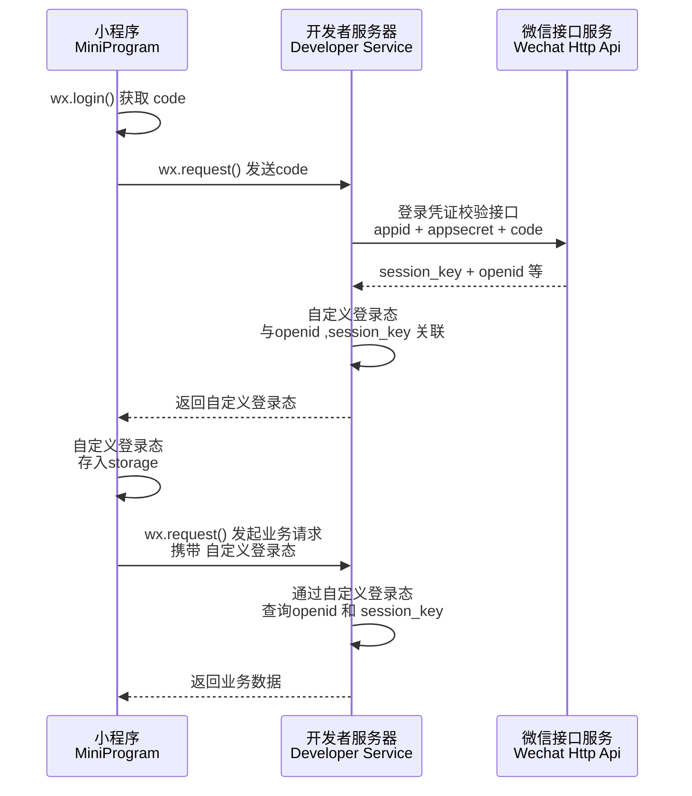
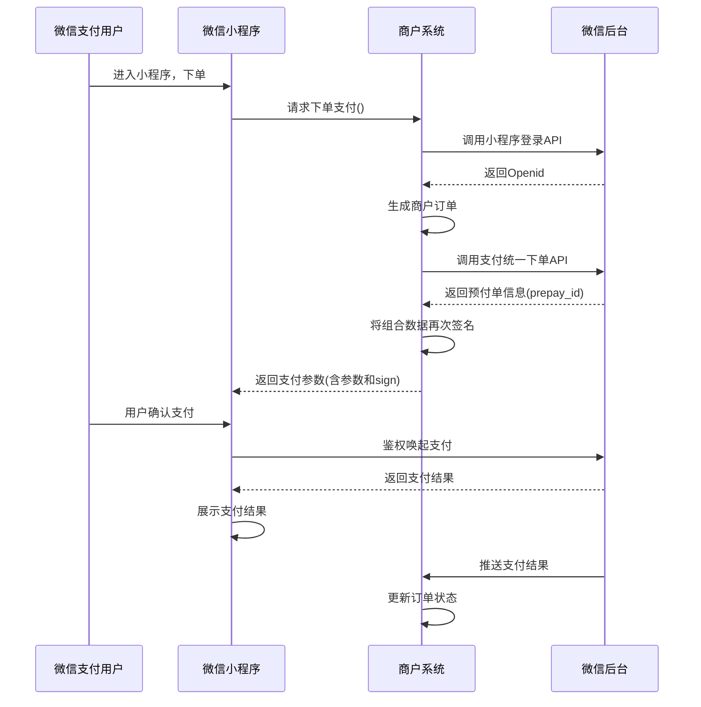
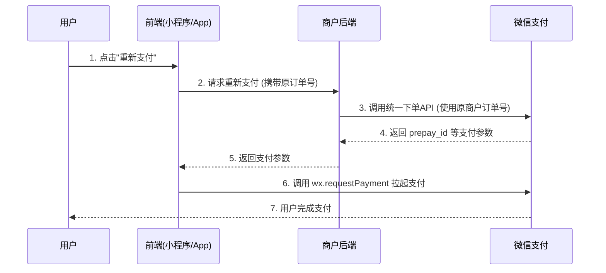

# 小程序系列

## 微信小程序的登录流程

### 登录流程

1️⃣ 微信小程序的登录流程图如下图所示


2️⃣微信小程序的登录步骤

- ① 获取当前登录微信用户的临时登录凭证（`code`）。
  - 调用 `wx.login()` 获取 `code` 。
  - 调用 `wx.getUserInfo()` 获取用户数据（`encryptedData`与 `iv`）。
- ② 通过 `appid` + `appsecret`+ `code`，换取 `openid` 和 `session_key`
  - 请求我们自己的后台服务器，将临时登录凭证（`code`）传给后端。
  - 后端把 `appid`、`appsecret`、 `code` 一起发送到微信服务器。
  - 微信服务器返回用户的唯一标识 `openid` 和会话密钥 `session_key`给自己的业务后端。
- ③ 拿到 `openid` 后将其存到数据库中，后端根据`openid`生成一个自定义登录态（如JWT token），返回给小程序端。
- ④ 小程序端保存登录态并后续携带

### 流程说明

| 角色                  | 动作             | 说明                                                  |
| --------------------- | ---------------- | ----------------------------------------------------- |
| 小程序 → 微信         | `wx.login()`     | 调用微信接口获取临时 `code`                           |
| 小程序 → 开发者服务器 | 发送 `code`      | 通过 `wx.request` 将 `code` 传给后端                  |
| 开发者服务器 → 微信   | 登录凭证校验     | 后端携带 `appid + secret + code` 调用微信接口         |
| 开发者服务器          | 关联登录态       | 生成自定义登录态，与 `openid`、`session_key` 关联存储 |
| 开发者服务器 → 小程序 | 返回自定义登录态 | 如返回 `JWT token` 或 `sessionId`                     |
| 小程序                | 存储登录态       | 存入 `wx.setStorageSync` 供后续使用                   |
| 小程序 ↔ 开发者服务器 | 后续业务请求     | 每次请求携带自定义登录态，后端校验后返回业务数据      |

### 扩展

> 实际业务中，我们还需要检查登录态是否过期，通常的做法是在登录态（临时令牌）中保存有效期数据，该有效期数据应该在服务端校验登录态时和约定的时间（如服务端本地的系统时间或时间服务器上的标准时间）做对比

> 这种方法需要将本地存储的登录态发送到小程序的服务端，服务端判断为无效登录态时再返回需重新执行登录过程的消息给小程

> 另一种方式可以通过调用`wx.checkSession`检查微信登录态是否过期
>
> - 若过期，则发起完整的登录流程
> - 若不过期，则继续使用本地保存的自定义登录态

### 注意事项

::: tip 注意事项

- 由于我们自己的小程序后台授权域名无法授权微信的域名，所以我们只能通过我们自己的服务器去调用微信服务器去获取用户信息。
- 临时登录凭证 `code`，有效期`5`分钟。
- `code` 只能使用一次，用于换取用户身份信息。
- `AppID` 和 `AppSecret（小程序密钥）`是在微信公众平台创建好小程序后，由微信官方分配给你的。
- `AppSecret`非常重要，绝不能像 `AppID` 那样直接写在客户端代码里，它只能在你受信任的后端服务器中使用。
- `openid` 用户的唯一标识。
- `session_key` 是对用户数据进行加密签名的密钥。
- `session_key` 不应返回给前端，只保存在后端用于后续解密。

补充说明

> 如果需要获取用户信息（头像、昵称）
>
> - 从 `2022` 年起，`wx.getUserInfo` 不再直接弹出授权框，需要使用 `wx.getUserProfile`（但该接口也在逐步调整）。

:::

### 参考文献

- https://segmentfault.com/a/1190000016750340
- https://juejin.cn/post/6955754095860776973
- https://www.cnblogs.com/zwh0910/p/13977278.html

## 微信小程序的发布流程

### 流程

- `上传代码`: 在开发者工具中上传代码，可以填写版本信息。
- `提交审核`: 代码上传完毕，可在微信公众平台后台提交审核，需要填写审核信息。
- `发布版本`: 当审核通过之后，即可提交发布。

### 扩展

通常的流程如下

- 代码管理服务器上新建分支
- 开发测试新需求
- 测试完成后，将本地分支合并到 master 分支
- 拉取 master 分支最新代码，执行 build 命令生成小程序可执行文件
- 开发者工具点击“上传”
- 提审
- 发布

### 参考文献

- [代码审核与发布](https://developers.weixin.qq.com/miniprogram/introduction/#提交审核)

  > 登录微信公众平台小程序，进入版本管理，开发版本中展示已上传的代码，管理员可提交审核或是删除代码。

- [发布上线](https://developers.weixin.qq.com/miniprogram/dev/framework/quickstart/release.html#发布上线)

  > 一般要经过 预览-> 上传代码 -> 提交审核 -> 发布等步骤。

- [小程序发布流程以及灰度发布流程整理](https://juejin.cn/post/6994414162700927012)

  > 小程序发布流程以及灰度发布流程整理

- [小程序发布教程](https://www.leapcloud.cn/website/docs/doc_config/xiaochengxu/xiaochengxu.html)
  > 小程序上线

## 微信小程序的支付流程

### 支付前言

> 在小程序内可调用微信的API完成支付功能，方便、快捷

- 用户通过分享或扫描二维码进入商户小程序，用户选择购买，完成选购流程
- 调起微信支付控件，用户开始输入支付密码
- 密码验证通过，支付成功。商户后台得到支付成功的通知
- 返回商户小程序，显示购买成功
- 微信支付公众号下发支付凭证

### 支付流程

1️⃣ 微信小程序支付流程图如下图示

2️⃣ 微信小程序支付步骤
- 打开某小程序，点击直接下单
- `wx.login()`获取用户临时登录凭证`code`，发送到后端服务器换取`openId`
- 在下单时，小程序需要将购买的`商品Id`、`商品数量`，以及用户的 `openId` 传送到服务器
- 服务器在接收到`商品Id`、`商品数量`、`openId`后，生成服务期订单数据，同时经过一定的签名算法，向微信支付发送请求，获取预付单信息(`prepay_id`)，同时将获取的数据再次进行相应规则的签名，向小程序端响应必要的信息
- 小程序端在获取对应的参数后，调用`wx.requestPayment()`发起微信支付，唤醒支付工作台，进行支付
- 接下来的一些列操作都是由用户来操作的，包括了微信支付密码，指纹等验证，确认支付之后执行鉴权调起支付
- 鉴权调起支付，在微信后台进行鉴权，微信后台直接返回给前端支付的结果，前端收到返回数据后对支付结果进行展示
- 推送支付结果，微信后台在给前端返回支付的结果后，也会向后台也返回一个支付结果，后台通过这个支付结果来更新订单的状态

📚 其中后端响应数据必要的信息则是`wx.requestPayment()`方法所需要的参数，大致如下

```js
wx.requestPayment({
  timeStamp: "", // 时间戳
  nonceStr: "", // 随机字符串
  package: "", // 统一下单接口返回的 prepay_id 参数值
  signType: "", // 签名类型
  paySign: "", // 签名
  success() {}, // 调用成功回调
  fail() {}, // 失败回调
  complete() {}, // 接口调用结束回调
});
```

### 重新支付

1️⃣ 针对用户下单后`未立即支付`的情况，实现`重新支付`功能的核心原则是

> 使用`相同`的`商户订单号（out_trade_no）`，`再次调用微信支付统一下单接口`。

微信支付接口具有幂等性设计，只要请求参数与原订单完全一致，接口会返回相同的支付参数（如 `prepay_id`），商户即可用这些参数再次拉起微信支付收银台，无需创建新订单

2️⃣ 微信小程序`重新支付`流程图如下图示



3️⃣ 微信小程序`重新支付`流程步骤如下

- 用户在小程序/APP 前端页面点击`重新支付`按钮。
- 前端向商户后端发起`重新支付`请求（携带原订单号）。
- 商户后端收到请求后，调用微信支付的统一下单 API（参数中使用原商户订单号）。
- 微信支付返回 `prepay_id` 等支付参数给商户后端。
- 商户后端将这些支付参数返回给前端。
- 前端调用 `wx.requestPayment()` 方法，拉起微信支付。
- 用户完成支付。


4️⃣ 支付结果确认与查单机制
- `前端轮询`
> 在调起支付后，前端应`立即启动轮询`，定期调用后端的“查单接口”，根据订单的最终状态更新页面（通常建议间隔2-5秒，持续60秒左右）。

- `后端查单`
> 后端必须实现一个稳定的“查单接口”。如果前端长时间未收到支付结果，用户再次进入订单页时，应自动触发查单动作，确保订单状态同步。

- `异步回调`
> 确保后端正确处理微信支付的`异步结果通知`。无论用户是否在支付页面等待，这个回调都会更新订单状态。

### 参考文献

- [发起微信支付](https://developers.weixin.qq.com/miniprogram/dev/api/payment/wx.requestPayment.html)

  > 发起微信支付，调用前需在小程序微信公众平台-功能-微信支付入口申请接入微信支付。

- [小程序调起支付](https://pay.weixin.qq.com/doc/v3/merchant/4012791898)

  > 通过`JSAPI/小程序`下单接口获取到发起支付的必要参数`prepay_id`，然后使用微信支付提供的小程序方法调起微信支付。

- [小程序支付模式介绍](https://pay.weixin.qq.com/doc/v3/merchant/4012791894)

  > 小程序支付，提供商户在自身微信小程序中使用微信支付收款的能力。

- [微信小程序支付功能全流程实践](https://juejin.cn/post/6844903895970349064)

## 微信小程序的实现原理
### 背景
网页开发，渲染线程和脚本是互斥的，如长时间的脚本运行可能会导致页面失去响应的原因，本质就是 `JS` 是单线程的。
而在小程序中，选择了 `Hybrid` 的渲染方式，将视图层和逻辑层是分开的，双线程同时运行，视图层的界面使用 `WebView` 进行渲染，逻辑层运行在 `JSCore` 中
- `渲染层`
> 界面渲染相关的任务全都在 `WebView` 线程里执行。一个小程序存在多个界面，所以渲染层存在多个 `WebView` 线程
- `逻辑层`
> 采用 `JsCore` 线程运行 `JS` 脚本，在这个环境下执行的都是有关小程序业务逻辑的代码

### 通信
> 在逻辑层发生数据变更的时候，通过宿主环境提供的`setData`方法把数据从逻辑层传递到渲染层，再经过对比前后差异，把差异应用在原来的`DOM`树上，渲染出正确的视图

> 当视图存在交互的时候，例如用户点击你界面上某个按钮，这类反馈应该通知给开发者的逻辑层，需要将对应的处理状态呈现给用户；对于事件的分发处理，微信进行了特殊的处理，将所有的事件拦截后，丢到逻辑层交给`JavaScript`进行处理

> 由于小程序是基于双线程的，也就是任何在视图层和逻辑层之间的数据传递都是线程间的通信，会有一定的延时，因此在小程序中，页面更新成了异步操作。异步会使得各部分的运行时序变得复杂一些，比如在渲染首屏的时候，逻辑层与渲染层会同时开始初始化工作，但是渲染层需要有逻辑层的数据才能把界面渲染出来

### 运行机制
1️⃣ 小程序启动运行两种情况
- `冷启动（重新开始）`
> 用户首次打开或者小程序被微信主动销毁后再次打开的情况，此时小程序需要重新加载启动，即为冷启动
- `热启动`
> 用户已经打开过小程序，然后在一定时间内再次打开该小程序，此时无需重新启动，只需要将后台态的小程序切换到前台，这个过程就是热启动

::: warning 注意事项
- 1.小程序没有重启的概念
- 2.当小程序进入后台，客户端会维持一段时间的运行状态，超过一定时间后会被微信主动销毁
- 3.短时间内收到系统两次以上内存警告，也会对小程序进行销毁，这也就为什么一旦页面内存溢出，页面会奔溃的本质原因了

:::

### 参考文献
- [浅谈小程序运行机制](https://developers.weixin.qq.com/community/develop/article/doc/0008a4c4f28f30fe3eb863b2750813)
- [微信小程序架构原理基础解析](https://juejin.cn/post/6976805521407868958#heading-5)
- [微信，支付宝小程序实现原理概述](https://juejin.cn/post/6844903805675388942)
- [简单说说微信小程序的底层原理](https://juejin.cn/post/6844903999863259144#heading-1)